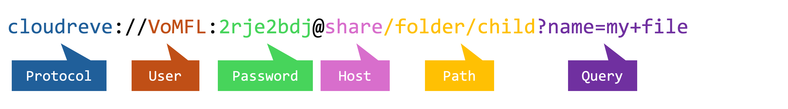

# File URI

Cloudreve uses `File URI` to locate, operate on files, or describe file search conditions.

## Structure {#structure}

The `File URI` used by Cloudreve conforms to traditional URL standards. When a `File URI` is parsed as a standard URL, the following parts are obtained:

This URI means: access the share link with share ID `VoMFL` using the password `2rje2bdj`, and list all files in the `folder/child` directory whose filenames contain `my file`.

### Protocol {#protocol}

Fixed as `cloudreve`.

### Host - File System Type {#host}

Defines the type of file system where the file is located.

- `my`: My files; defaults to the files of the currently authenticated user. You can also fill in the ID of another user in `User` to access other users' files, for example, `cloudreve://luPa@my`. Only administrators can access other users' files through `my`.
- `shared_with_me`: Shared with me;
- `trash`: Trash;

### User - File System ID {#user}

Cloudreve uses the `User` part to specify the file system ID.

- For the `my` file system, `User` is the user ID; if left blank, it is the ID of the currently authenticated user.
- For the `shared_with_me` file system, `User` cannot be empty and is the share link ID.

### Password - File System Password {#password}

Currently, only the `share` file system uses the `Password` part. When a share link is not public, the `Password` part is needed to specify the access password. Cloudreve will generate a password and include it directly in the share link obtained by the creator.

### Path - File Path {#path}

File path, used to specify the location of the file in the file system.

### Query - Search Conditions {#query}

File search conditions, used to specify file search conditions, applicable only to APIs that list files. For APIs that operate on specified files (delete, update, etc.), this part will be ignored.
