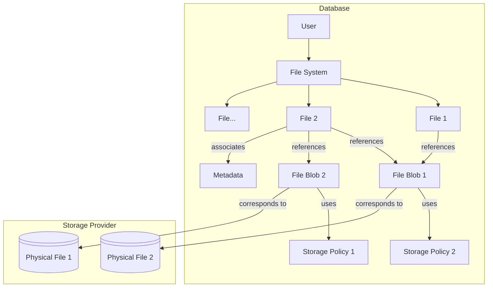
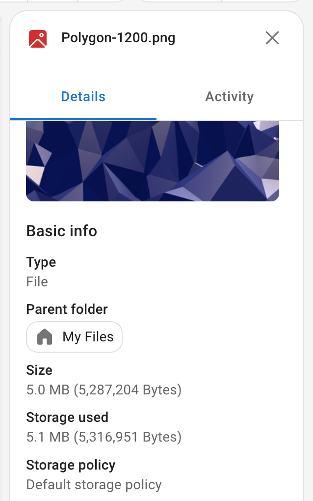

# Concepts {#concept}

Cloudreve is a cloud storage system that creates an abstraction layer on top of the physical file system. This section will introduce several core concepts in Cloudreve, understanding them will help you better use Cloudreve.

Cloudreve's file system mainly consists of `Files`, `File Blobs`, `Metadata`, `Storage Policies`, and `Physical Files`. Among these, `Files`, `File Blobs`, and `Metadata` are stored in the database, while `Physical Files` are stored in storage providers defined by storage policies. Here's a simplified example:

## Files {#file}

A `File` is what users see in the file explorer in Cloudreve, and folders are also a special type of file.

### Files and File Blobs {#file-and-file-blob}

A `File` can contain one or more `File Blobs`, with the actual file content stored in the `File Blobs`.

When version retention is enabled for a `File`, each modification to the file content generates a new `File Blob`, while the previous version's `File Blob` remains associated with that `File` for version history. Even when version retention is not enabled, Cloudreve still generates a new `File Blob` when users update file content, and then disassociates the old version's `File Blob`.

When a `File` generates thumbnails (only for Cloudreve proxy generation), Cloudreve stores the thumbnail data in a thumbnail `File Blob` and associates it with that `File`.

A `File`'s "size" refers to the size of the current version's `File Blob`. A `File`'s "storage used" is the sum of all associated `File Blobs`' sizes.

### Files and Storage Policies {#file-and-storage-policy}

A `File` is also associated with a preferred `Storage Policy`:

- For regular files, it only represents how to store new `File Blobs`, not the actual storage location of existing files.
- For folders, it represents the storage policy for new files in that directory. If no storage policy is specified for the folder, it uses the parent directory's settings.

When the preferred `Storage Policy` doesn't exist or is unavailable, it falls back to using the first available `Storage Policy` for the user.

### Files and Metadata {#file-and-metadata}

A `File` is associated with zero to multiple `Metadata` entries, which record additional information about the file, such as media file information, EXIF data, thumbnail status, etc.

### Copying {#copy}

When a user copies a `File`, the `File` and its associated `Metadata` are copied to create new records, but the associated `File Blobs` are not copied; instead, new `File Blob` associations are created in the newly generated `File`.

## File Blobs {#file-blob}

A `File Blob` represents the actual stored data, referencing a physical file on the storage provider through an associated `Storage Policy` and a path reference. `File Blobs` are immutable. A `File Blob` can be associated with multiple `Files`, such as when a `File` is copied multiple times, these `Files` share the same set of `File Blobs`. When a `File Blob` is not associated with any `File`, it is considered unused and will eventually be removed by Cloudreve's queue scheduler, which will delete the corresponding physical file on the storage provider.

`File Blob` types include: versions, thumbnails, and Live Photos.

## Physical Files {#physical-file}

A `Physical File` is the actual file on the storage provider, with its path recorded in a `File Blob`.

## Storage Policies {#storage-policy}

A `Storage Policy` defines how files are stored, storage provider configurations, and file upload and download configurations. Each user group is assigned to a `Storage Policy`, and users can only use the `Storage Policy` assigned to their user group.

::: info <Badge type="tip" text="Pro" />
In the Pro edition, a user group can be assigned to multiple `Storage Policies`, and users can freely choose which `Storage Policy` to use.
:::

## Metadata {#metadata}

`Metadata` records additional information about files, such as media file information, EXIF data, thumbnail status, etc. Each metadata entry is associated with a unique `File`, and a `File` can have zero to multiple metadata entries. Metadata contains `Name` and `Value` fields; if the name starts with `sys:`, it indicates system metadata that cannot be modified by users.

Common information recorded in metadata includes:

- File media information
- Custom directory icons/colors
- Thumbnail status
- Share links corresponding to shortcut files
- Original path of files in the recycle bin
- Expiration date of files in the recycle bin
- File tags

For more information about metadata, please refer to the [Metadata](../api/metadata) chapter.

Metadata can be used for file searching.

## File Permissions {#file-permission}

File permissions define the access permissions for other users when this file is **a descendant of a shared directory**, if not set, Cloudreve will search upwards for the first available permission setting of the parent directory until it reaches the shared root directory.

When a user shares a directory, the directory's own permissions are ignored because the user sets the permissions of the shared link when sharing, this setting overrides the directory's permissions, but the permissions of its subdirectories remain effective.

For single file sharing, the file's permission settings are ignored, and the permission settings of the shared link are used.

::: tip

File permissions are invalid for the admin user group, the admin user group always has all permissions.

:::
