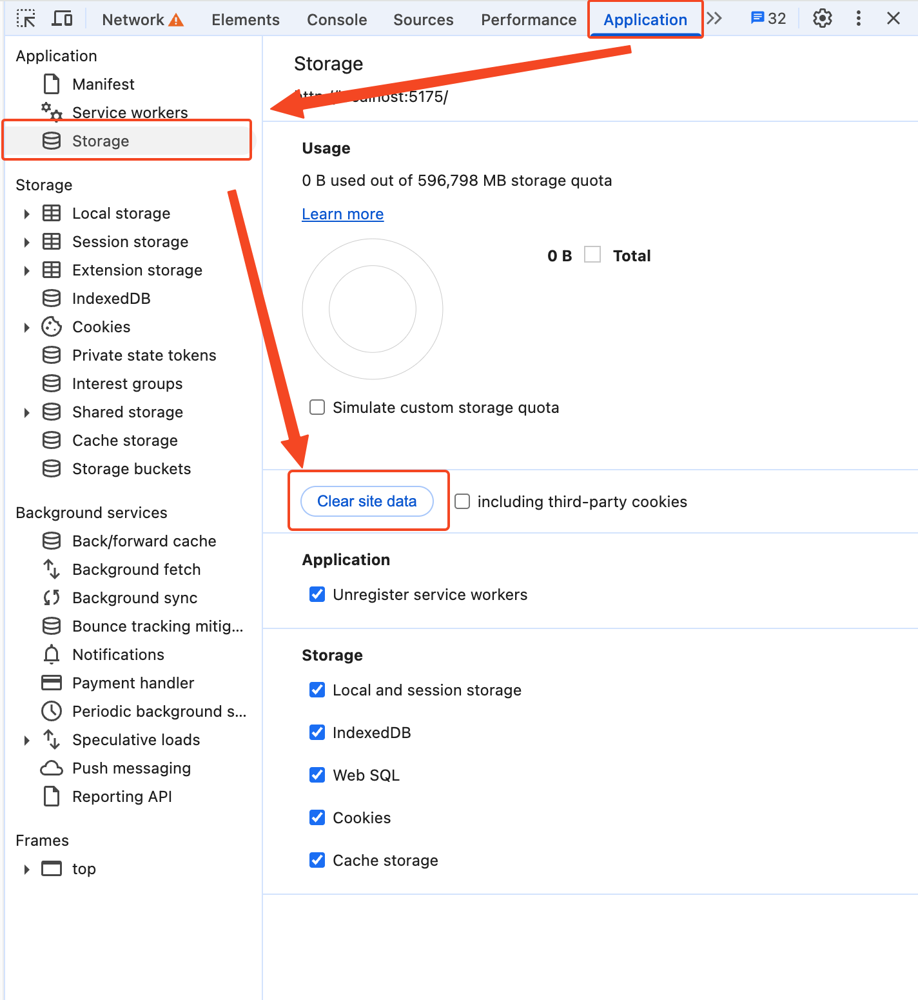

# Custom Frontend {#custom-frontend}

Cloudreve's executable file has embedded static resources, including HTML documents, JS scripts, CSS, image resources, etc. When a browser requests these static resources, they are served from the embedded data. This section will introduce how to customize these static resources.

::: warning

When using custom static resources, please note that you need to replace them with newly built static resources when updating Cloudreve.

:::

## Using Custom Static Resources {#use}

Please rename the `build` directory compiled from the [frontend repository](https://github.com/cloudreve/frontend) to `statics` and place it in the `data` directory under the same directory as Cloudreve executable, then restart Cloudreve for the changes to take effect. Upon startup, Cloudreve will print `Folder with xxx already exists, it will be used to serve static files.` in the log, indicating that custom static resources are being used.

::: tip <Badge type="tip" text="Pro" />

Pro edition users can obtain the frontend source code from the license management dashboard.

:::

## Extracting Built-in Static Resources {#eject}

You can also add the `eject` subcommand when starting Cloudreve to extract the built-in static resources to the `data/statics` directory:

```bash
./cloudreve eject
```

## i18n {#i18n}

Cloudreve's i18n resource files are located in the `statics/public/locales/<language identifier>` directory. Translations are divided into different files, and can be referenced using the format `filename:section.key`, for example: `application:login.lastStep` corresponds to the `lastStep` key in the `login` section of the `application.json` file.

### Adding New Translations

Create a new directory in the `statics/public/locales` directory. The directory name must be a language+region identifier from the ISO 639-1 standard, such as `zh-CN`, `en-US`, etc. After completing the translation, you need to register the new language pack in [`i18n.ts`](https://github.com/cloudreve/frontend/blob/master/src/i18n.ts):

```ts
export const languages = [
  {
    code: "en-US",
    displayName: "English",
  },
  {
    code: "zh-CN",
    displayName: "简体中文",
  },
  { // [!code ++]
    code: "zh-TW", // [!code ++]
    displayName: "繁體中文", // [!code ++]
  }, // [!code ++]
];

export default i18n;
```

After making changes, you need to recompile the frontend resources.

## Cache {#cache}

Cloudreve registers a ServiceWorker in secure contexts to cache static resources. When users first visit the Cloudreve site, all static resources are automatically requested and cached. For language packs, Cloudreve caches them in LocalStorage and synchronizes the language pack cache when frontend resources are updated.

### Clearing Cache

When ServiceWorker is registered, users will receive an update prompt when static resource versions change, and the page will refresh to get the latest resources. If you need to manually delete the cache, use <kbd>F12</kbd> to open the browser's `Developer Tools` -> `Application` -> `Storage` -> `Clear site data` to delete the cache.



### Troubleshooting Cache Issues

If you experience the following issues after updating Cloudreve or static resources:

* No update prompt appears on the user side;
* Users still see the old version of the UI;

Please refer to [Check Cache Configuration](../overview/deploy/configure#check-cache) to troubleshoot the problem. 