# File Applications {#file-apps}

File applications allow users to edit or preview files directly in their browser when accessing Cloudreve sites via the web interface. Cloudreve comes with built-in applications for common file types, and you can freely add more applications.

## Adding Applications {#add-app}

To add new applications, go to the Cloudreve admin panel under `Settings` -> `Filesystem` -> `File applications`.

### Embedded Webpage Viewer {#embed-app}

Embedded webpage viewer is a built-in application type in Cloudreve that only requires you to provide a webpage URL. Cloudreve will pass file information and temporary download URLs to the webpage through query parameters. Typical examples include public file preview services provided by Google Docs or Microsoft Office.

### WOPI Protocol Applications {#wopi-app}

Import file processing services compatible with the WOPI protocol, such as OnlyOffice. For details, please refer to [Office Document Online Editing](wopi).

### New File Actions {#new-file-mapping}

After adding actions, users will see suggestions for using this application when clicking the `New` button.

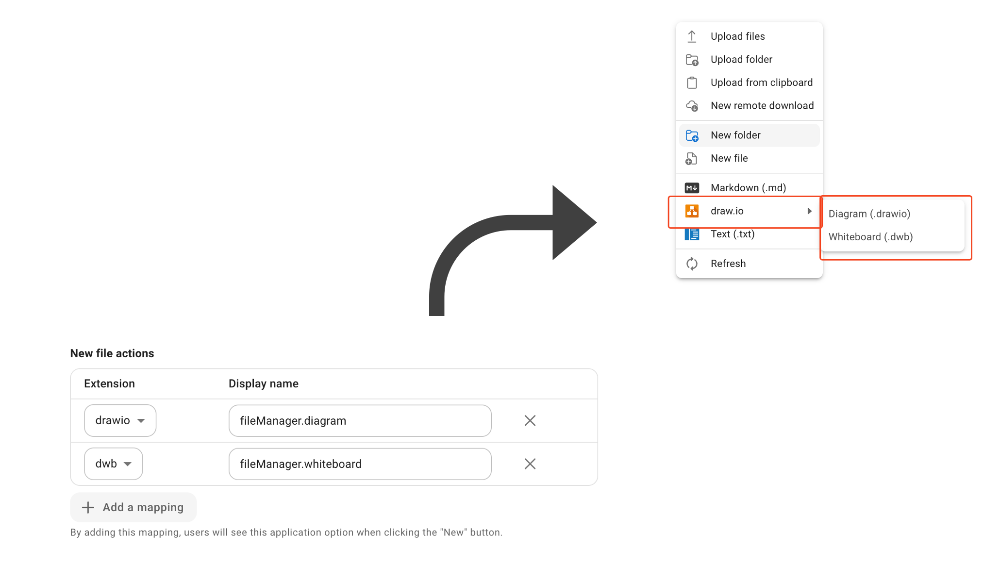

## Music Player {#music-player}

Cloudreve has a built-in music player application, with supported formats [depending on the browser](https://en.wikipedia.org/wiki/HTML_audio#Supported_audio_coding_formats).

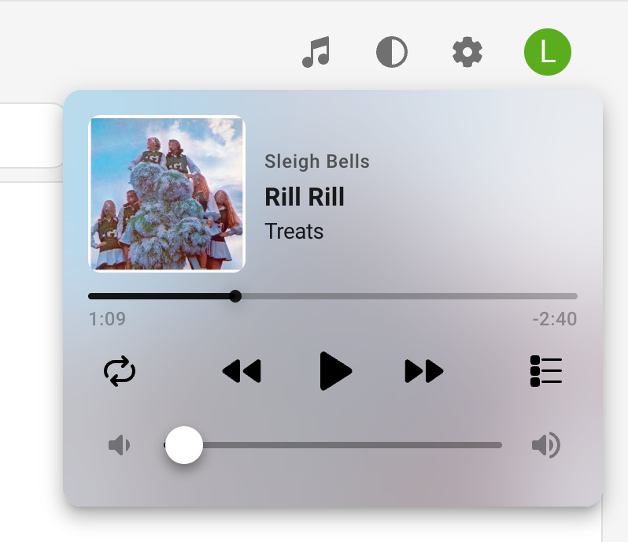

Some features of the music player may depend on other functionality:

- When file thumbnails exist, they'll be displayed as album covers and blurred backgrounds. For details, please refer to [Music Cover Thumbnail Generator](thumbnails#song-cover).
- When song name, album, and artist information exists in the file metadata, they'll be shown preferentially; otherwise, the filename will be displayed. For details, please refer to [Media Metadata Extraction](media-meta).

## ePub Reader {#epub-reader}

Supports reading ePub format e-books, with reading progress saved in the browser.

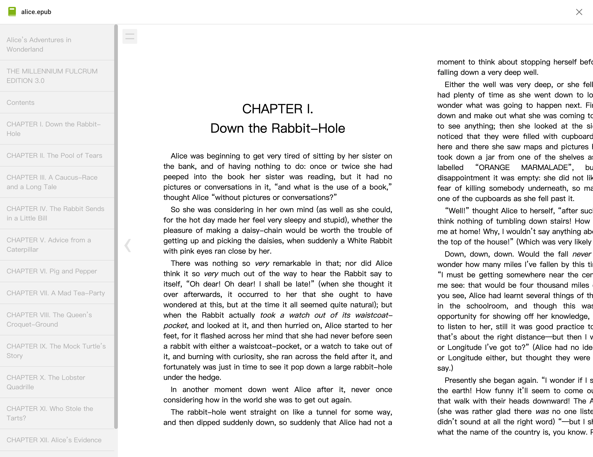

## Google Docs / Microsoft Office Online Viewing {#google-docs-office-online}

Cloudreve includes two custom application instances: read-only preview services for public documents provided by Google and Microsoft. If you need online collaborative editing functionality, please refer to [Office Document Online Editing](wopi).

To use these public services, the following requirements must be met:

1. Your `Primary Site URL` configured in `Settings` -> `Basic` -> `Site URL` must be publicly accessible and use standard ports (80 or 443).
2. The file size and format must meet the requirements of the preview service. For example, Microsoft's preview service requires files to be no larger than 10MB.

## PDF Reader {#pdf-reader}

A PDF reader based on [PDF.js](https://github.com/mozilla/pdf.js), supporting PDF file reading and annotation. Currently, annotation information cannot be saved.

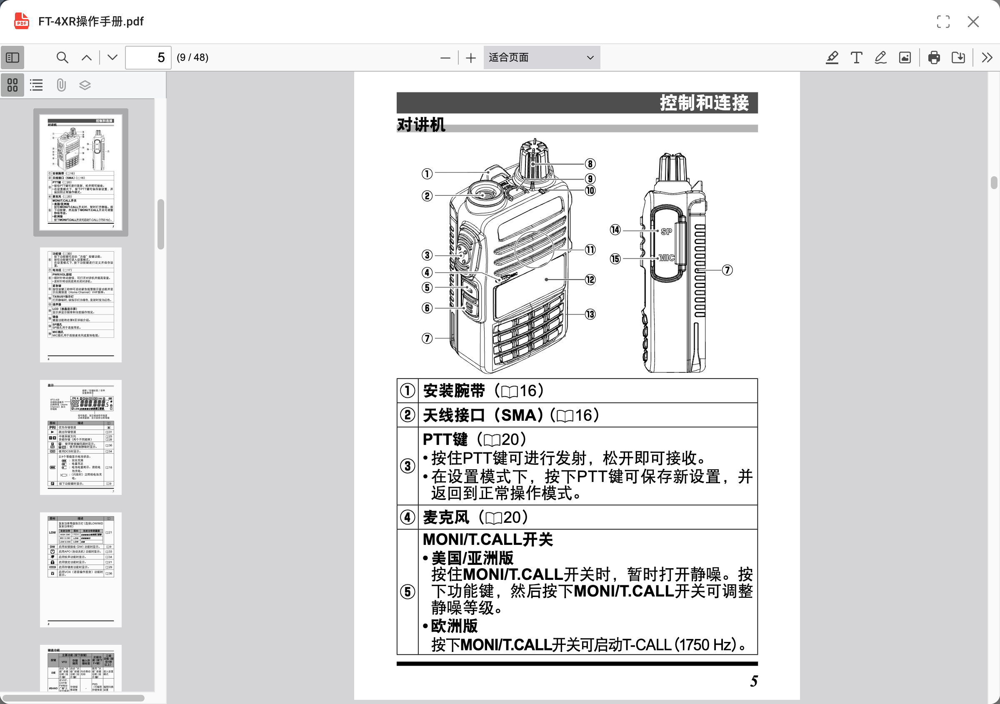

## Video Player {#video-player}

Cloudreve has a built-in video player application, with supported formats [depending on the browser](https://en.wikipedia.org/wiki/HTML_video#Browser_support), and additionally supports m3u8 playlists.

### External Subtitles

Supports three formats: `ass`, `srt`, and `vtt`. When subtitle files with the same name as the video file exist in the directory, they will be loaded automatically. You can also select them manually.

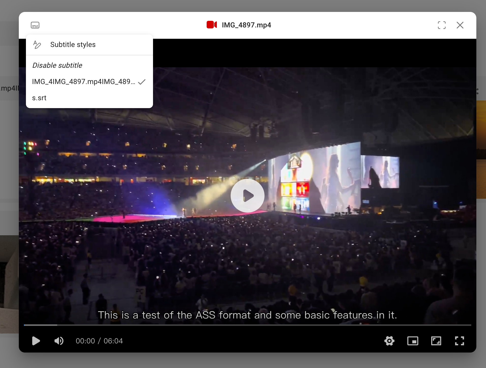

::: warning

Subtitle support has the following limitations:

- Cannot load subtitles embedded in videos
- ASS subtitle styles will be lost

:::

### Chapters

When chapter information exists in the file's media metadata, it will be displayed in the progress bar:

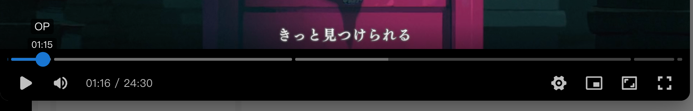

To use this feature, you need to configure the FFprobe media information extractor. Please refer to [Media Metadata Extraction](media-meta).

### m3u8

The video player supports m3u8 playlists through [hls.js](https://github.com/video-dev/hls.js), which can be used for video quality segmentation, live streaming, and other scenarios.

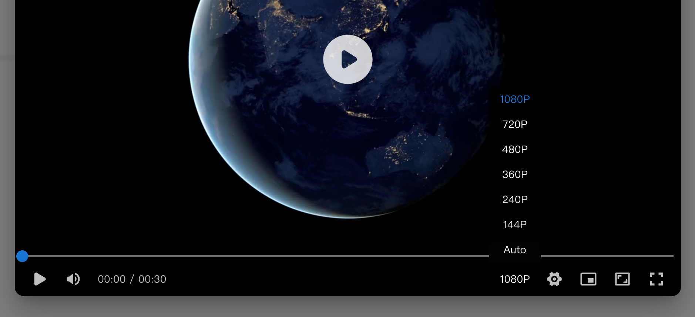

When an m3u8 file uses relative or absolute paths to reference segments, playlists, or other files, Cloudreve automatically converts them to URLs relative to the m3u8 file during playback. Make sure these segment files are also uploaded to Cloudreve and stored in the correct directory.

::: details <Badge type="tip">Example</Badge> Creating encrypted video segments with multiple resolutions using FFMpeg and uploading them to Cloudreve for playback.

1. Prepare the original video `example.mp4`.
2. Generate an encryption key:

   ```bash
   openssl rand 16 > enc.key
   ```

3. Upload `enc.key` to your Cloudreve site and get a direct link (or use other similar service).
4. Create an `enc.keyinfo` file with the direct link to the key on the first line and the local path to `enc.key` on the second line, for example:

   ```
   http://cloudreve.org/f/gVVUW/enc.key
   enc.key
   ```

5. Use FFMpeg to create encrypted video segments with multiple resolutions:

   ```bash
   ffmpeg -y -i example.mp4 -preset slow -g 48 -sc_threshold 0 -map 0:0 -map 0:1 -map 0:0 -map 0:1 -map 0:0 -map 0:1 -map 0:0 -map 0:1 -map 0:0 -map 0:1 -map 0:0 -map 0:1 -s:v:0 "1920*1080" -b:v:0 1800k -s:v:1 "1280*720" -b:v:1 1200k -s:v:2 "858*480" -b:v:2 750k -s:v:3 "630*360" -b:v:3 550k -s:v:4 "426*240" -b:v:4 400k -s:v:5 "256*144" -b:v:5 200k -c:a copy -var_stream_map "v:0,a:0,name:1080p v:1,a:1,name:720p v:2,a:2,name:480p v:3,a:3,name:360p v:4,a:4,name:240p v:5,a:5,name:144p" -master_pl_name master.m3u8 -f hls -hls_time 10 -hls_key_info_file enc.keyinfo -hls_playlist_type vod -hls_list_size 0 -hls_segment_filename "v%v/segment%d.ts" v%v/index.m3u8
   ```

6. Upload `master.m3u8` and all segment directory files to your Cloudreve site, maintaining the file directory structure. You can use the `Directory Upload` feature.

During playback, Cloudreve will automatically replace the relative path segment URLs in `master.m3u8` with actual temporary Blob URLs of the segment files and use the key in `enc.keyinfo` to decrypt the segment files.

:::

## Markdown Editor {#markdown-editor}

Supports editing and previewing Markdown files. When file content is invalid, preview mode parsing may fail. Please switch to source code mode to view.

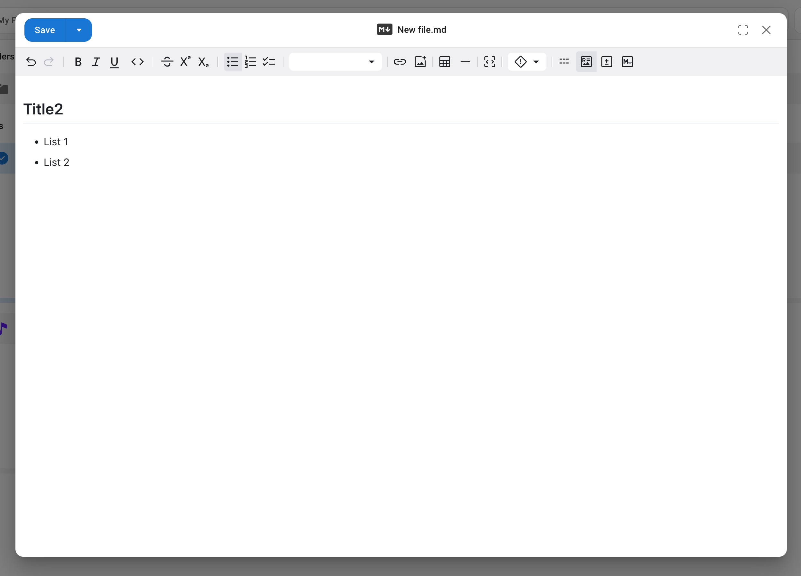

## Image Viewer {#image-editor}

The image viewer supports image preview and editing:

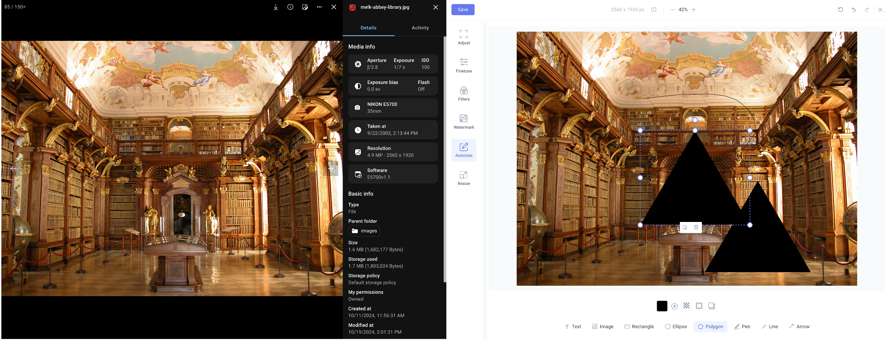

You can use the [Media Metadata Extraction](media-meta) feature to obtain EXIF information from images and display it in the image viewer.

## Draw.io {#drawio}

Supports online editing of diagrams or whiteboards using Draw.io, with collaborative capabilities.

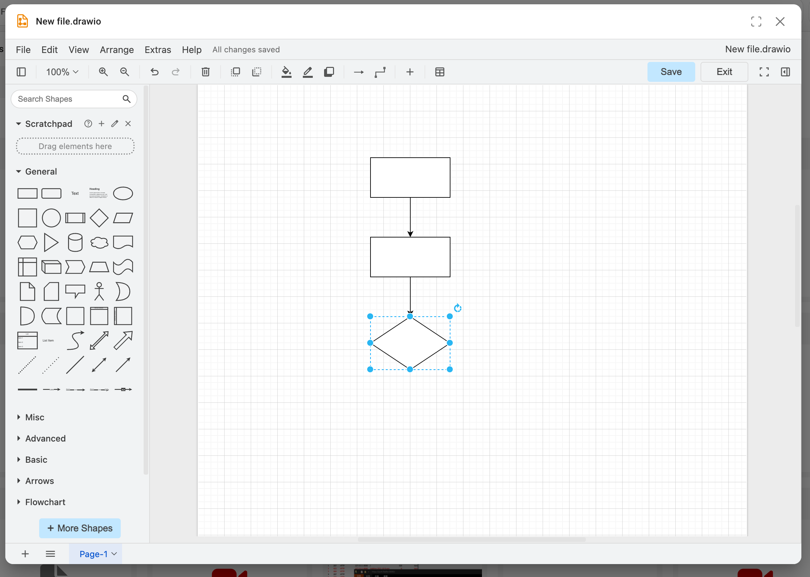

By default, it uses the online service from `diagrams.net`. You can edit this application in Cloudreve to provide the address of your self-hosted DrawIO service.

## Text Editor {#monaco}

Supports code editing using the Monaco online editor, with syntax highlighting for multiple languages and encoding switching.

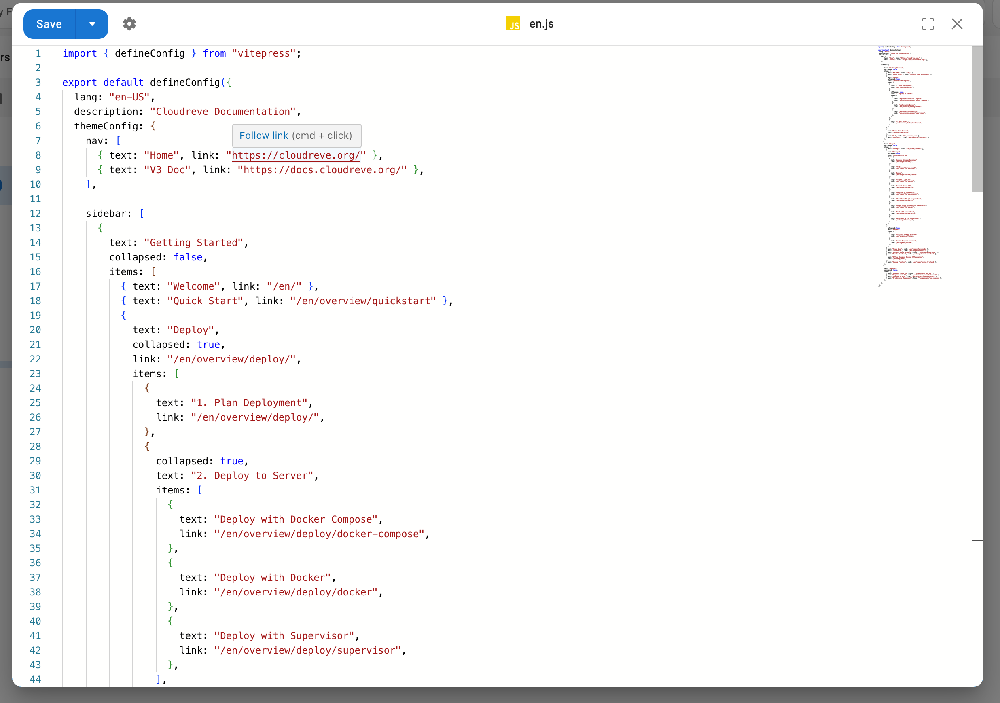

::: warning

Regardless of which encoding you choose to open the file with, or what the original file encoding is, files will be saved using UTF-8 encoding.

:::

## Photopea {#photopea}

Use Photopea to edit images, PSD, and other files online.

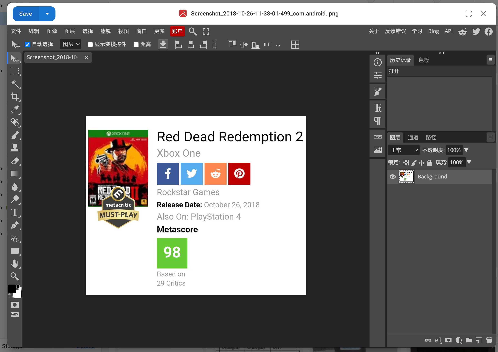

::: warning

Photopea uses `https://www.photopea.com` as the `Referrer` header when requesting file content. If you have configured hotlinking protection, please ensure this request header is allowed.

:::
