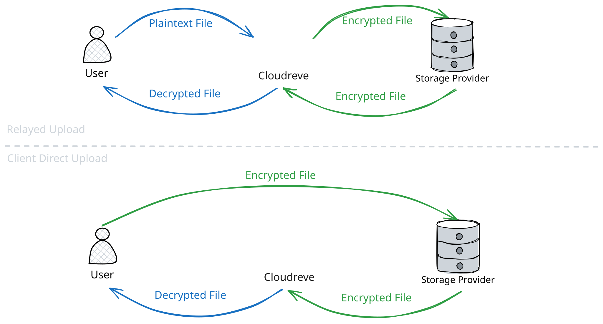
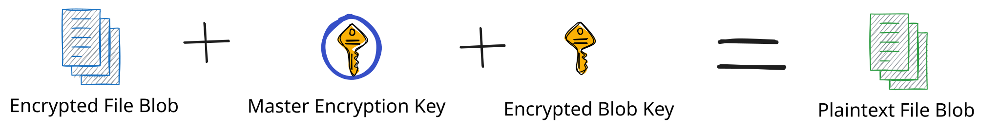

# File Encryption {#file-encryption}

Cloudreve supports enabling file encryption for storage policies. Once enabled, all newly uploaded files to that storage policy will be encrypted, and Cloudreve will automatically decrypt them during download. Encrypted files can only be accessed through Cloudreve.

File encryption is completed by the Web client by default. Encrypted file data is directly transmitted to the storage provider. If the storage policy has `Upload replay` enabled, the client will only transmit the plaintext file to Cloudreve, and Cloudreve will perform streaming encryption and transmission to the storage provider.

All downloads of encrypted files must be relayed through Cloudreve, which will perform streaming decryption while sending the file to the client.



## Configuration {#configure}

On the storage policy configuration page, enable `File encryption` to enable file encryption. Before deciding to enable file encryption for a storage policy, please ensure you have understood and checked the following:

- Encrypted files can only be accessed through Cloudreve.
- When `Upload replay` is not enabled:
  - File encryption will be completed by the client. This process is not mandatory, and some older client versions or third-party implementations may refuse to follow the encryption settings and upload original files instead.
  - Please enable and configure chunked upload to avoid long waiting times before uploading large files.
  - Your site needs to support secure context (HTTPS).
  - When the client uploads files, the encryption key of the new file will be exposed to the client.
- After enabling file encryption, the storage policy's native thumbnail generator will not be available. It is recommended to enable generator proxy.
- Regardless of whether `Download relay` is enabled, downloading encrypted files will automatically be relayed through Cloudreve.

## Encryption Algorithm {#encryption-algorithm}

Cloudreve uses the AES-256-CTR cipher for file encryption. Each file Blob is encrypted with an independent key. The key for the file Blob is encrypted using the master encryption key and stored in the database.



::: warning
By default, Cloudreve will randomly generate a master encryption key on first startup and store it in the database. The potential risk is that the master encryption key and the keys of each Blob are stored in the same location, which could be leaked simultaneously in a security incident. We recommend storing the master encryption key in a different location according to the instructions in the next section and rotating it regularly.
:::

## Master Encryption Key Management {#rotate-master-encryption-key}

If you need to rotate the master encryption key or switch the storage method of the master encryption key, follow these steps:

1. In the admin panel under `Filesystem` -> `Settings` -> `File Encryption` -> `Master encryption key storage`, confirm the current master encryption key storage method.
2. Back up the `entities` table in the database.
3. Use the following command to get and back up the current master encryption key:

   ```bash
   ./cloudreve master-key get -c <your Cloudreve config file> [--license-key <your Pro edition license key>]

   ## For example
   ./cloudreve master-key get -c data/conf.ini --license-key xxx
   ```

   Back up the output master encryption key to a secure location.

4. Choose a method to generate a new master encryption key: 32 random bytes, encoded with Base64.

   ::: tabs
   === Cloudreve

   ```bash
   ./cloudreve master-key generate -o new.key
   ```

   === OpenSSL

   ```bash
   openssl rand -base64 32 > new.key
   ```

   :::

5. Execute the following command to re-encrypt all file Blob keys using the new master encryption key:

   ```bash
   ./cloudreve master-key rotate -c <your Cloudreve config file> -n <new master encryption key file> [--license-key <your Pro edition license key>]

   ## For example
   ./cloudreve master-key rotate -c data/conf.ini -n new.key --license-key xxx
   ```

6. If needed, change the master encryption key storage method in `Filesystem` -> `Settings` -> `File Encryption` -> `Master encryption key storage`.
7. Store the new master encryption key to a secure location according to the new storage method.
   ::: tabs
   === Database
   No additional action required. Cloudreve will automatically store the new master encryption key to the database in step 5.
   === File
   Store the new master encryption key file to a secure location.

   ```bash
   mv new.key /path/to/new.key
   ```

   In `Filesystem` -> `Settings` -> `File Encryption` -> `Key storage path`, enter the storage path of the new master encryption key file.

   === Environment Variable
   Configure the environment variable when starting Cloudreve, set `CR_ENCRYPT_MASTER_KEY` to the value of the new key.
   :::

8. Restart Cloudreve to apply the new master encryption key. Check if file upload and download work properly, then delete the leftover `new.key` file and backup files.
