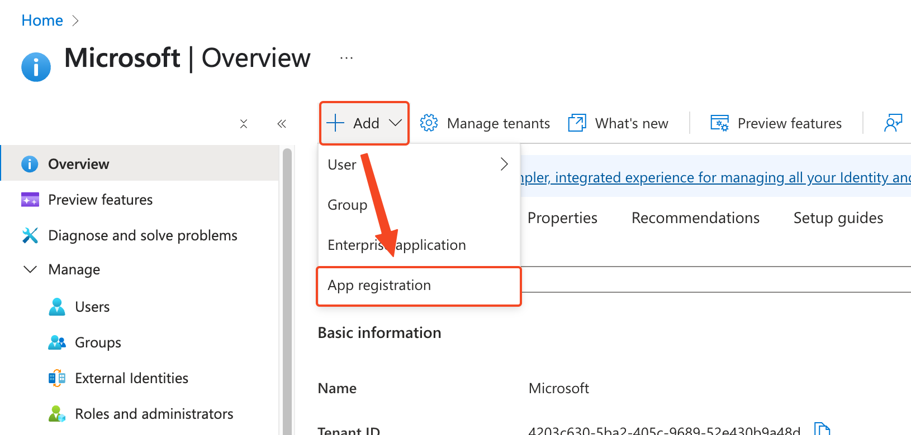
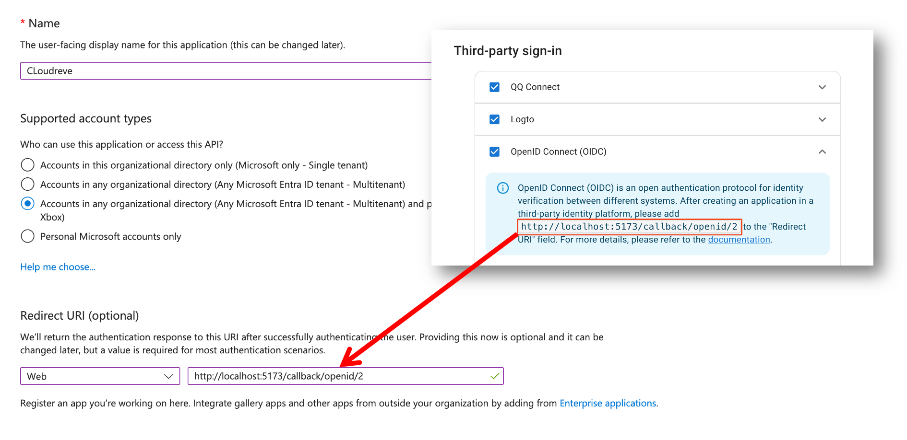
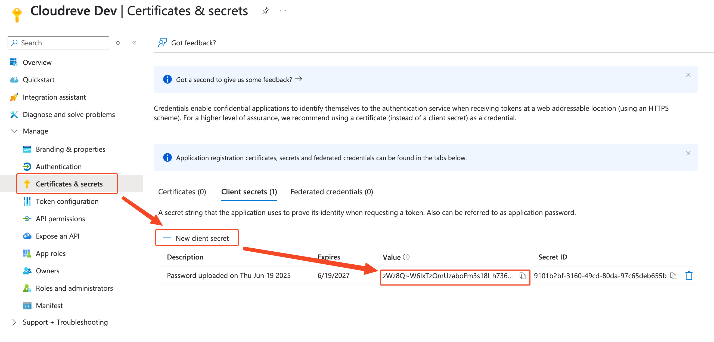
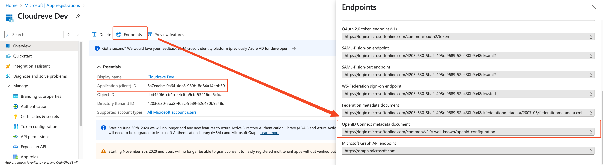
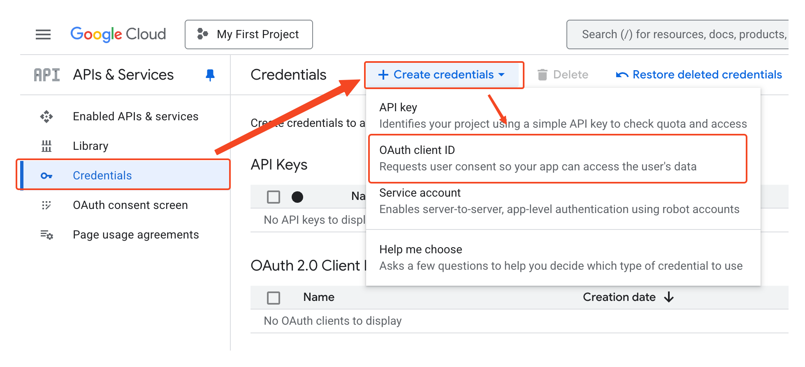
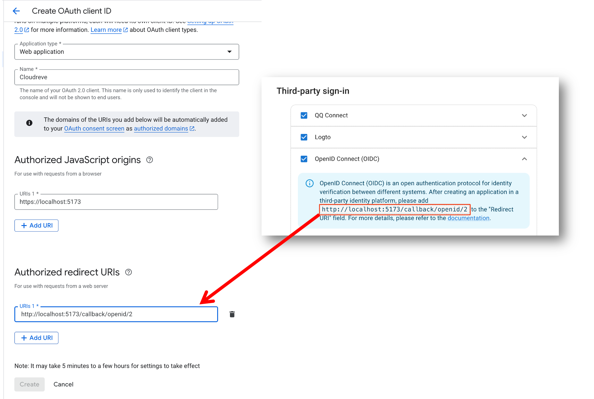
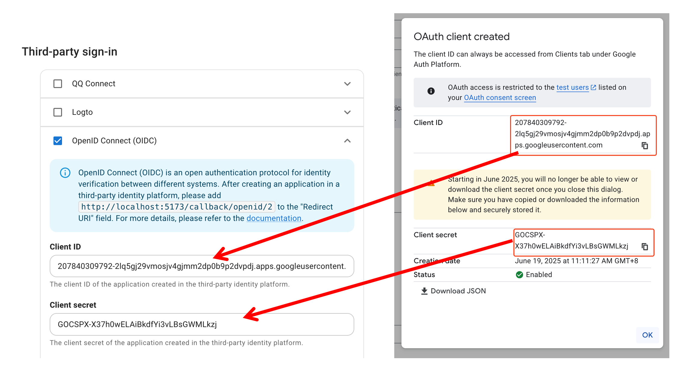

# OIDC Authentication {#oidc}

::: tip <Badge type="tip" text="Pro" />
This section only applies to the Pro edition.
:::

Cloudreve supports connecting to authentication services that comply with the [OpenID Connect (OIDC)](https://openid.net/developers/how-connect-works/) specification to implement single sign-on. This article will illustrate how to connect to the authentication services of Microsoft Entra ID (Azure AD) and Google.

## Logto {#logto}

Cloudreve natively supports [Logto](https://logto.io/). You can directly configure Logto's authentication service in the Cloudreve admin panel under `Settings` -> `User Session` -> `Third-party sign-in`.

## Tencent QQ

Cloudreve natively supports [QQ Connect](https://connect.qq.com/). You can directly configure Tencent QQ's authentication service in the Cloudreve admin panel under `Settings` -> `User Session` -> `Third-party sign-in`.

## Microsoft Entra ID (Azure AD) {#microsoft-entra-id-azure-ad}

### Create an Application Registration

Log in to the [Azure portal](https://portal.azure.com/), select `Microsoft Entra ID` from the left navigation bar, then select `Add`, and click `App registration`.



Enter the application name in the `Name` field, for example, `Cloudreve`, and select `Supported account types` as needed. Go to the Cloudreve admin panel `Settings` -> `User Session` -> `Third-party sign-in`, check `OpenID Connect (OIDC)` and get the redirect URL from the prompt, fill it in, and select the type as `Web`.



### Configure Client Secret

After creating the application, select `Certificates & secrets` from the left navigation bar, click `New client secret`, enter a description for the secret, click `Add`, and fill the obtained secret value into Cloudreve's `Client Secret` field.



::: tip Important
Please note that after the client secret expires, you need to generate a new one and update it in Cloudreve.
:::

### Configure Client ID and Discovery Document

Go back to the application's "Overview" page, copy the `Application (client) ID` into Cloudreve's `Client ID` field. Click `Endpoints` and copy the `OpenID Connect metadata document` URL for later use.



In Cloudreve's `OIDC Wellknown Config` section, click `Import from URL`, paste the `OpenID Connect metadata document` URL copied in the previous step, and submit.

After saving the settings, you can use Microsoft Entra ID (Azure AD) for authentication.

## Google

### Create an Application Registration

Log in to the [Google Cloud Console](https://console.cloud.google.com/), select `APIs & Services` -> `Credentials` from the left navigation bar, then `Create credentials` -> `OAuth client ID`.



Select the application type as `Web application`, and enter the application name in the `Name` field, for example, `Cloudreve`. Go to the Cloudreve admin panel `Settings` -> `User Session` -> `Third-party sign-in`, check `OpenID Connect (OIDC)` and get the redirect URL from the prompt, and fill it into `Authorized redirect URIs`.
In `Authorized JavaScript origins`, enter your site address, for example, `https://cloudreve.org`.



### Configure Client ID and Secret

After creating the application, a dialog will show the `Client ID` and `Client secret`. Fill them into Cloudreve's `Client ID` and `Client Secret` fields.



### Configure Discovery Document

In Cloudreve's `OIDC Wellknown Config` section, click `Import from URL`, enter `https://accounts.google.com/.well-known/openid-configuration` and submit.

After saving the settings, you can use Google for authentication.

## OIDC Compatibility

The OIDC service connected to Cloudreve has the following basic requirements:

Required:

- Support for using `client_secret_post` to exchange for an `access_token`;
- Support for `response_type` of `code`;
- Supported `scope` includes `openid`, `email`, `profile`;
- Provides a `userinfo_endpoint` to get user information;
- Can present the `state` parameter;

Not required, but recommended:

- Provide Email and avatar URL in `userinfo_endpoint`;
- Provide `end_session_endpoint` to redirect the user to the authentication server to log out;

### User info fields mapping {#custom-user-info-mapping}

Cloudreve uses [UserInfo](https://openid.net/specs/openid-connect-core-1_0.html#UserInfo) to get user profile information. By default, the expected response format is:

```json
{
  "sub": "1234567890",
  "name": "John Doe",
  "email": "john.doe@example.com",
  "picture": "https://example.com/avatar.jpg"
}
```

If the OIDC provider provides a non-standard UserInfo response format, you can configure it through `User info fields mapping`. For example, the following response:

```json
{
  "attributes": {
    "uid": "5900055",
    "securityEmail": "support@cloudreve.org",
    "cn": "Aaron Liu",
    "status": "Active"
  },
  "id": "5900055"
}
```

You can configure the following mapping relationships:

| Field                    | Mapping                    |
| ------------------------ | -------------------------- |
| User info fields mapping | `attributes.uid`           |
| Email                    | `attributes.securityEmail` |
| Display name             | `attributes.cn`            |

You can use [GJSON](https://github.com/tidwall/gjson/blob/master/SYNTAX.md) syntax to describe the JSON field path.
