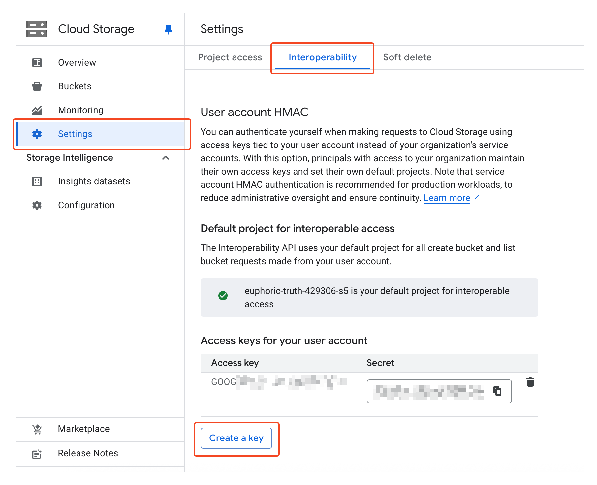
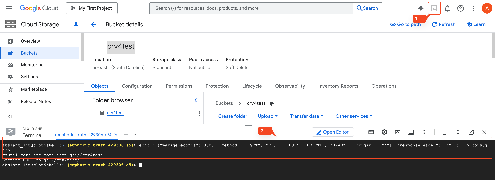

# Google Cloud Storage (S3 Compatible) {#gcs}

Store files using [Google Cloud Storage](https://cloud.google.com/storage) with S3 compatible storage policy.

## Configuration {#configure}

### Creating Buckets and Access Credentials

Create a bucket in the Google Cloud Console, then go to `Settings` -> `Interoperability` -> `User Account HMAC`, and create a set of access keys:



In Cloudreve, create an `S3 Compatible` storage policy and fill in the information according to the following rules:

- For `Bucket Name` in the storage policy, enter the name of the bucket you just created;
- For `Endpoint` in the storage policy, enter `https://storage.googleapis.com`;
- For `Region` in the storage policy, enter `auto`;
- For `Access credential` in the storage policy, enter the `Access Key` and `Secret` of the access key you just created;

### Configuring CORS Policy

The bucket needs to be configured with a CORS policy before you can use the Cloudreve web interface to upload or browse files. Google Cloud Storage does not support one-click CORS policy configuration and needs to be configured manually. Below is a working example of a CORS configuration file:

```json
[
  {
    "maxAgeSeconds": 3600,
    "method": ["GET", "POST", "PUT", "DELETE", "HEAD"],
    "origin": ["*"],
    "responseHeader": ["*"]
  }
]
```

Open a Cloud Shell window in the upper left corner of the Google Cloud console and execute the following commands:

```bash
echo '[{"maxAgeSeconds": 3600, "method": ["GET", "POST", "PUT", "DELETE", "HEAD"], "origin": ["*"], "responseHeader": ["*"]}]' > cors.json
gsutil cors set cors.json gs://your-bucket-name
```



For detailed operation documentation, please refer to [Set up and view CORS configurations ](https://cloud.google.com/storage/docs/using-cors).

## FAQ {#faq}

::: details Upload error: `Request failed: AxiosError: Network Error`

1. Check if the user can connect to `storage.googleapis.com`;
2. Check if the bucket CORS policy is set and if the settings are correct;

:::

::: details Upload error: `Chunk upload failed: Invalid argument.`

Check `Settings` -> `Filesystem` -> `Upload session TTL (seconds)`, its value should be less than `864000`.

:::

::: details Transfer upload failed, error: `Unable to parse response`

1. Expand the detailed error and check if the error message contains `413 Request Entity Too Large`.

   If so, modify your Nginx reverse proxy configuration, set or increase the value of `client_max_body_size`, such as `client_max_body_size 20000m;`. This setting value should be larger than the size of the files being uploaded.

2. Check if there is an external WAF firewall blocking the upload request.

:::
