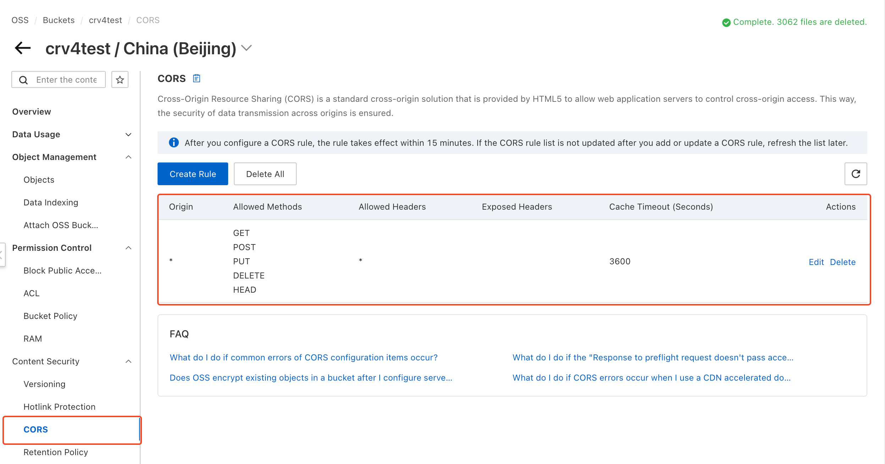
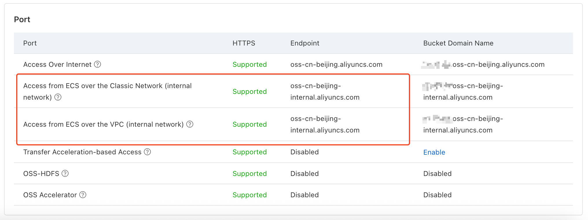

# Alibaba Cloud OSS {#oss}

Using [Alibaba Cloud OSS](https://www.alibabacloud.com/product/oss) buckets to store files.

## Configuration {#configure}

### CORS Policy {#cors}

The bucket needs to be configured with a CORS policy before it can be used with Cloudreve's web client for uploading or browsing files. Normally, you can let Cloudreve automatically configure the CORS policy while adding a storage policy. If you need to configure it manually, please add it in `Content Security` -> `CORS`.



### Intranet Endpoint {#internal-endpoint}

If your Cloudreve is deployed on Alibaba Cloud ECS and is in the same availability zone as your OSS, you can additionally specify an intranet endpoint to save network traffic costs. Cloudreve will switch to the intranet endpoint when conditions are met.



When you configure an intranet endpoint for a storage policy, the following scenarios will switch to the intranet endpoint:

- Server-side transfer upload;
- Server-side relayed upload (when storage policy has `Upload relay` enabled);
- File management requests (delete, create upload session, etc.);
- Server-side relayed download (when storage policy has `Download relay` enabled);
- Other requests that require the server to download files;

When using slave nodes to process tasks, the public endpoint will be used.

## Using Custom Domain Endpoint {#custom-endpoint}

If you only need to use a custom domain (such as a CDN) in file download URLs, you can configure a `Download CDN` in the storage policy. After configured, the hostname and path in the file download URL will be replaced with the CDN URL you provided, but file upload and management requests will still use the official endpoint provided by OSS. This section will explain how to configure a custom endpoint for all requests.

### Prepare Custom Domain

Please set up your custom domain with a CNAME record or reverse proxy to the `Bucket Domain Name` with the Bucket name prefix. Add and verify this domain in the OSS bucket configuration under `Bucket Setting` -> `Domain Names`.

If you don't want to add your custom domain in the OSS bucket configuration, you can still proceed, but your domain must reverse proxy to the `Bucket Domain Name` - direct CNAME resolution won't work. When configuring the reverse proxy, please rewrite the request `Host` header to the official `Bucket Domain Name` with the Bucket name, otherwise OSS cannot identify your Bucket. Reference configuration methods:

::: tabs

=== Nginx

```nginx
location / {
    proxy_pass https://<bucket-name>.oss-<region>.aliyuncs.com;
    proxy_set_header Host <bucket-name>.oss-<region>.aliyuncs.com;
}
```

=== Caddy

```
reverse_proxy https://<bucket-name>.oss-<region>.aliyuncs.com {
	header_up Host {upstream_hostport}
}
```

=== Cloudflare

You need `Origin Rules` included in the `Enterprise` plan to rewrite the `Host` header. Please refer to [Change URI Path and Host Header](https://developers.cloudflare.com/rules/origin-rules/examples/change-uri-path-and-host-header/).

:::

::: warning
Whether using reverse proxy or CNAME resolution, the target endpoint must be the `Bucket Domain Name` with the Bucket name prefix. Don't mistakenly use the `Endpoint` without the Bucket name prefix.
:::

### Enable Custom Endpoint

Fill in your custom domain in the storage policy configuration under `Basic Information` -> `Endpoint`, and check the `This is a custom domain` option.

## FAQ {#faq}

::: details Upload error: `Unable to complete file upload: Private address is forbidden to callback. (InvalidArgument)`

Please check if the `Main Site URL` under `Settings` -> `Basic` is correctly set. It must be an address accessible from the public internet.

:::

::: details Upload error: `Unable to complete file upload: xxxxx (CallbackFailed)`

This error indicates that OSS cannot reach your callback URL. Please check if the `Main Site URL` under `Settings` -> `Basic` is correctly set. It must be an address accessible from the public internet.

In the error message, `xxxx` is the specific error when requesting the callback address. Please troubleshoot based on this error information.

:::

::: details Upload error: `Unable to create upload session: xxxxx The bucket you are attempting to access must be addressed using the specified endpoint. Please send all future requests to this endpoint`

1. Check the `Endpoint` setting in the storage policy, avoid checking the `This is a custom domain` option when using the official endpoint;
2. If you are using a custom endpoint:
   - Make sure it points to the `Bucket Domain Name` with the Bucket name, not the official `Endpoint`;
   - Make sure you've added and verified this custom domain in your OSS bucket configuration; or that you've correctly rewritten the `Host` header in your reverse proxy configuration;

:::

::: details Relay upload failed, error: `Unable to parse response`

1. Expand the detailed error, check if the error message contains `413 Request Entity Too Large`

   If yes, please modify the Nginx reverse proxy configuration, set or increase the value of `client_max_body_size`, for example `client_max_body_size 20000m;`. This value should be greater than the size of the uploaded file.

2. Check if an external WAF firewall is blocking the upload request.

:::

::: details Upload error: `Request failed: AxiosError: Network Error xxx`

1. Check if the `Endpoint` setting in the storage policy is correct:

   - Whether the user side can access this Endpoint;
   - If the site is using HTTPS, please ensure that the Endpoint you filled in is also HTTPS, and a valid SSL certificate is configured;

2. Check if the bucket CORS policy is set and if it is correct;

:::

<!--@include: ./parts/refer-photopea.md-->
