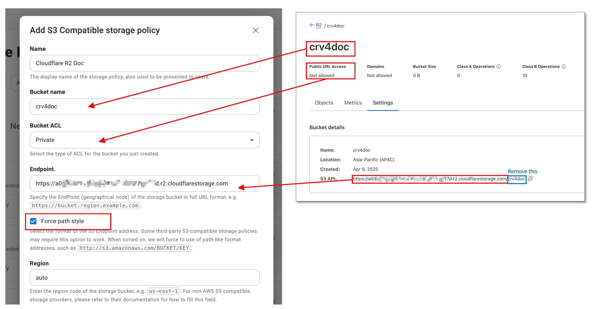
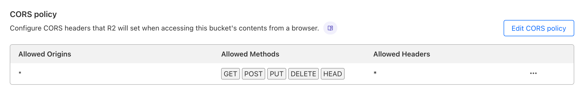

# Cloudflare R2 (S3 Compatible) {#r2}

Store files using [Cloudflare R2](https://www.cloudflare.com/products/r2/) with S3 compatible storage policy.

## Configuration {#configure}

Create an R2 bucket in the Cloudflare dashboard, go to settings, get the bucket information and fill it in the storage policy:



- For `Bucket Name` in the storage policy, enter the name of the bucket you just created;
- For `Endpoint` in the storage policy, enter the `S3 API` address provided by R2 with the bucket name at the end removed;
- Check the `Force path style` option;
- For `Region` in the storage policy, enter `auto`;

In the Cloudflare R2 bucket list, go to `API` -> `Manage API Tokens`, create an user API token, select `Admin Read & Write` for `Permissions`, and get the `Access Key ID` and `Secret Access Key` to fill in the `Access credentials` of the storage policy.

### CORS Policy

The bucket needs to configure a CORS policy before you can use Cloudreve's web client to upload or browse files. Normally, you can let Cloudreve automatically configure the CORS policy when adding a storage policy. If you need to configure it manually, please add it in the R2 bucket `Settings` -> `CORS policy`.

```json
[
  {
    "AllowedOrigins": ["*"],
    "AllowedMethods": ["GET", "POST", "PUT", "DELETE", "HEAD"],
    "AllowedHeaders": ["*"],
    "ExposeHeaders": ["ETag"],
    "MaxAgeSeconds": 3600
  }
]
```



## Using Publicly Accessible Buckets {#public-access}

::: warning Warning

When using publicly accessible buckets, anyone can access your files without authorization.

:::

To use publicly accessible buckets, enable the `Public Access` option in the R2 bucket settings and bind a custom domain. Then navigate to the storage policy settings:

- Enable `Use CDN for download traffic` and fill in your custom domain in the `Download CDN` field.
- **Uncheck** `Force path style Endpoint`.

## Reverse Proxy Private Bucket Download Requests {#reverse-proxy}

If you need to reverse proxy the download request of a private storage bucket, please enable the `Use CDN for download traffic` option in the storage policy settings and fill in your custom domain in the `Download CDN` field.

When configuring the reverse proxy, please note the following points:

- The reverse proxy target is the R2 endpoint without the bucket name, for example, `https://a02xxxxxxxxx.r2.cloudflarestorage.com`;
- The `Host` header needs to be overridden in the upstream request, for example, `Host: a02xxxxxxxxx.r2.cloudflarestorage.com`;

As an example, the following is the Caddy configuration:

```text
reverse_proxy {
    to https://a09xxxxxxxxxxx.r2.cloudflarestorage.com
    header_up Host a09xxxxxxxxxxx.r2.cloudflarestorage.com
}
```

## FAQ {#faq}

::: details Upload error: `Request failed: AxiosError: Network Error`

1. Check if the storage policy `Endpoint` setting is correct:
2. Check if the CORS policy is set and configured correctly;
3. Check `Settings` -> `Filesystem` -> `Upload session TTL (seconds)`, its value should be less than `604800`.

:::

::: details Transfer upload failed, message: `Unable to parse response`

1. Expand the detailed error, check if the error message contains `413 Request Entity Too Large`.

   If so, please modify the Nginx reverse proxy configuration to set or increase the value of `client_max_body_size`, for example, `client_max_body_size 20000m;`. This setting value should be larger than the size of the uploaded file.

2. Check if an external WAF firewall is blocking the upload request.

:::

::: details Upload error: `Unable to create upload session: Unknown error (failed to create multipart upload: AccessDenied: Access Denied`

Check if the storage policy `Access credentials` are correct; this token must have `Admin Read & Write` permissions.

:::
