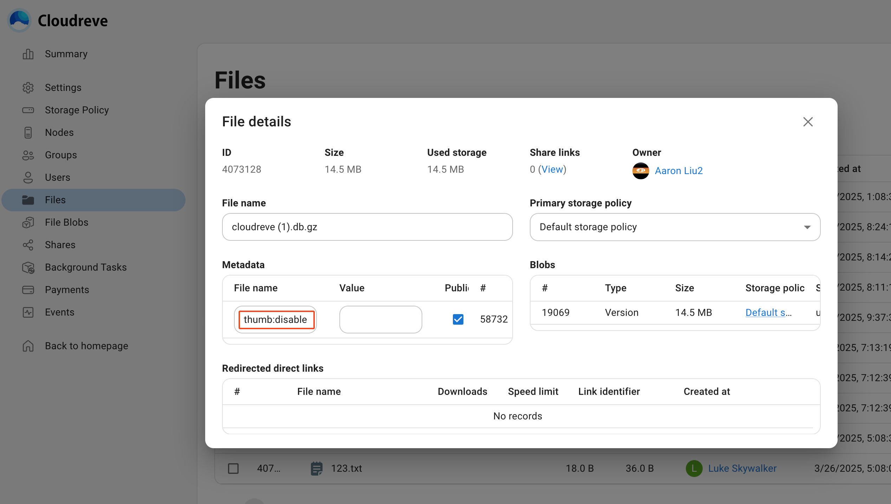
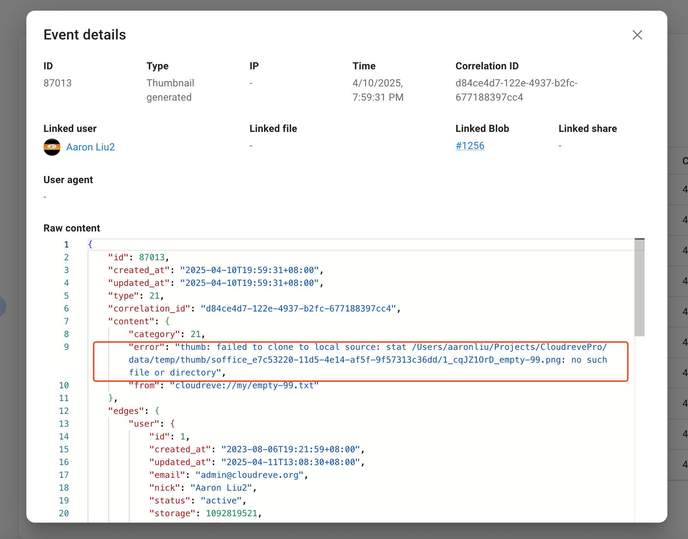

# Thumbnails {#thumbnails}

Cloudreve supports various thumbnail generators for different types of files, including images, videos, and Office documents. You can also extend thumbnail generation capabilities to storage policies that don't originally support it through the "thumbnail proxy" feature.

## Generation Logic {#thumbnail-generation-logic}

### When to Generate {#when-to-generate}

Cloudreve doesn't immediately generate thumbnails after file upload, but rather when users attempt to load them. This section describes when Cloudreve decides to load thumbnails. For each file, its thumbnail status can be categorized into two states:

- `Unknown` Default state for newly uploaded files. When viewing this file in the file list, Cloudreve will attempt to load or generate a thumbnail.
  - If a thumbnail file Blob already exists, it will be used directly as the thumbnail.
  - If the thumbnail file Blob doesn't exist, Cloudreve will attempt to generate one.
- `Thumbnail doesn't exist` When viewing this file in the file list, Cloudreve won't display a thumbnail.

In the following cases, a file's thumbnail status will be reset to `Unknown`:

- The file is renamed and its extension changes;
- The file content is updated.

In following cases, a file's thumbnail status will be reset to `Thumbnail doesn't exist`:

- No available thumbnail generator is found;
- Generator failed to generate a thumbnail;

### How to Generate

This section describes how Cloudreve generates thumbnails for files. Cloudreve supports multiple thumbnail generators and uses a "pipeline" approach, trying each generator in sequence until one successfully returns a thumbnail. Currently supported generators and their order are shown in the table below:

<div style="overflow-x: auto">
  <table>
    <thead>
      <tr>
        <th>Generator</th>
        <th>Description</th>
        <th>Unsupported Storage Policies</th>
        <th width="156">Priority (High to Low)</th>
      </tr>
    </thead>
    <tbody>
      <tr>
        <td>Native in Storage Policy</td>
        <td>
          Uses the third-party storage policy's native capabilities to generate thumbnails. It doesn't produce a thumbnail Blob, but only generates a URL for redirection.
        </td>
        <td>Local, S3</td>
        <td>1</td>
      </tr>
      <tr>
        <td>Music Cover</td>
        <td>
          No third-party dependencies, built into Cloudreve. Extracts album covers from MP3 (ID3v1, 2.x), MP4 (ACC, M4A, ALAC), OGG, or FLAC. This generator depends on any other image generator (Cloudreve built-in or VIPS) to compress the extracted cover image. When the source file is on a third-party storage, it attempts to use Range requests to download only the necessary parts, without downloading the entire file.
        </td>
        <td>All storage policy types except local storage that haven't enabled "generator proxy".</td>
        <td>2</td>
      </tr>
      <tr>
        <td>LibreOffice</td>
        <td>
          Uses LibreOffice to generate thumbnails for Office documents. This generator depends on any other image generator (Cloudreve built-in or VIPS). When the source file is on a third-party storage, it will download the entire source file.
        </td>
        <td>All storage policy types except local storage that haven't enabled "generator proxy".</td>
        <td>3</td>
      </tr>
      <tr>
        <td>VIPS</td>
        <td>Uses libvips to process thumbnail images, supports more image formats, and consumes fewer resources. When the source file is on a third-party storage, it will download the entire source file.</td>
        <td>All storage policy types except local storage that haven't enabled "generator proxy".</td>
        <td>4</td>
      </tr>
      <tr>
        <td>FFmpeg</td>
        <td>
          Uses FFmpeg to generate video thumbnails. When the source file is on a third-party storage, it attempts to use Range requests to download only the necessary parts, without downloading the entire file.
        </td>
        <td>All storage policy types except local storage that haven't enabled "generator proxy".</td>
        <td>5</td>
      </tr>
      <tr>
        <td>Cloudreve Built-in</td>
        <td>
          No third-party dependencies, uses Cloudreve's built-in image processing capabilities, only supports PNG, JPEG, and GIF formats. When the source file is on a third-party storage, it will download the entire source file.
        </td>
        <td>All storage policy types except local storage that haven't enabled "generator proxy".</td>
        <td>6</td>
      </tr>
    </tbody>
  </table>
</div>

Detailed descriptions of each generator are in the following sections.

### Proxy Thumbnail Generation {#thumbnail-proxy}

By default, all non-native storage policies only support using the storage policy native generator, which is the fastest but has limited support for file formats, and some storage policies (such as S3) even do not support thumbnail generation. You can enable the proxy thumbnail generation feature in `Storage Policy Settings` -> `Thumbnails` -> `Proxy thumbnail generation`. After enabling it, if the native generator fails to generate a thumbnail, Cloudreve will attempt to use the configured generator pipeline, and then upload the generated thumbnail back to the storage policy.

## Generators

### Native in Storage Policy

Uses the storage policy's native image processing service to generate thumbnails. You can set the file extensions and size limits to use in `Storage Policy Settings` -> `Thumbnails`. Different storage providers support different file formats; please refer to the storage provider's documentation.

::: tip

For remote storage policies, you can refer to the [Native Thumbnails](./storage/remote#native-thumbnail) section to extend native thumbnail capabilities.

:::

### Music Cover {#song-cover}

No third-party libraries required. Extracts album covers from MP3 (ID3v1, 2.x), MP4 (ACC, M4A, ALAC), OGG, or FLAC. Depends on any other image-supporting generator (VIPS or Cloudreve native).

### LibreOffice

Homepage: [https://www.libreoffice.org/discover/libreoffice/](https://www.libreoffice.org/discover/libreoffice/)

This generator can create thumbnails for Office documents and depends on any other image-supporting generator (VIPS or Cloudreve native).

For Ubuntu, install LibreOffice:

```sh
sudo apt install libreoffice
```

### VIPS

Homepage: [https://www.libvips.org/](https://www.libvips.org/)

For Ubuntu:

```sh
sudo apt install libvips-tools
```

Cloudreve only supports libvips 8.5 or newer. You can check your installed version with:

```sh
vips -v
```

Some older distribution package managers may not have the latest version of libvips. It's recommended to compile and install the latest version from source: [https://www.libvips.org/install.html](https://www.libvips.org/install.html)

### FFMpeg {#ffmpeg}

Homepage: [https://ffmpeg.org](https://ffmpeg.org/)

For Ubuntu:

```shell
sudo apt install ffmpeg
```

### Cloudreve Built-in

Can directly generate thumbnails for common images (PNG, JPEG, GIF).

## Troubleshooting Thumbnails Not Displaying {#troubleshoot-thumbnail-not-displayed}

If you've configured the appropriate thumbnail generators but thumbnails still don't display, refer to this section for step-by-step troubleshooting.

### Confirm Thumbnail Status

Confirm whether the file's thumbnail status is marked as `Thumbnail doesn't exist`. Find the file in the admin dashboard and check if `thumb:disabled` exists in the `Metadata`:



If it exists, it means the previous thumbnail generation failed, causing this file to be marked as `Thumbnail doesn't exist`. You can remove the `thumb:disabled` metadata, or rename the file to a different extension and then rename it back to reset the thumbnail status.

After resetting, refresh the browser page (not just the file list) to see if the thumbnail appears.

### Confirm if Native Thumbnail Generator is Used

Go to the storage policy settings for this file and check the native thumbnail settings under `Thumbnails`. Verify if this file's extension and size meet the conditions for native thumbnails:

- If they meet the conditions, then the native thumbnail generator is being used, but the thumbnail still doesn't display. Check the storage provider's configuration: for example, whether the corresponding image processing service is enabled, or if the storage provider actually supports this file format.
- If they don't meet the conditions, check if the generator proxy is enabled:
  - If not enabled, the thumbnail not displaying is expected since no generator is available;
  - If enabled, go to `Settings` -> `Media Processing` -> `Thumbnails` to check if there is a generator that can handle this file.
    - If none exists, there's no available generator, so the thumbnail not displaying is expected;
    - If one exists, continue with the troubleshooting process.

### Check Thumbnail Generator

Thumbnail generators may not work properly for various reasons. Go to the `Events` list in the admin panel and filter for events of type `Thumbnail generated`. Find the thumbnail generation event for the corresponding file and check the error message recorded in the event:



::: tip

You can also [enable Debug mode](../overview/configure#debug-mode) and then trigger thumbnail generation again to view the log output from Cloudreve.

:::

### Check Thumbnail Blob

If the thumbnail generator works correctly but the thumbnail still doesn't display, check if the thumbnail Blob exists. View the file details; under `Data`, the thumbnail Blob size will be shown. If the thumbnail Blob exists, the issue might be with the storage policy causing the thumbnail to fail to load. Refer to the documentation for the specific storage policy to troubleshoot file download issues.

## Generation Queue {#thumbnail-queue}

All non-native thumbnail generation requests are managed through a queue. You can go to the admin panel's `Settings` -> `Queue` -> `Thumbnail Generation` to set queue parameters. Thumbnail queue tasks are not persisted, so they cannot be found in the `Background Tasks` list.

## Frequently Asked Questions {#faq}

::: details Some LibreOffice thumbnails succeed while others fail.

A known issue is that LibreOffice sometimes fails to start when generating multiple thumbnails simultaneously. You can adjust the thumbnail queue worker thread count to 1-2 to avoid generating many thumbnails at the same time.

:::

::: details When will thumbnails consume user storage capacity?

Thumbnails generated using non-native generators are stored in a thumbnail Blob, which counts against the user's storage capacity. Storage policy native thumbnails do not consume user capacity.

:::
