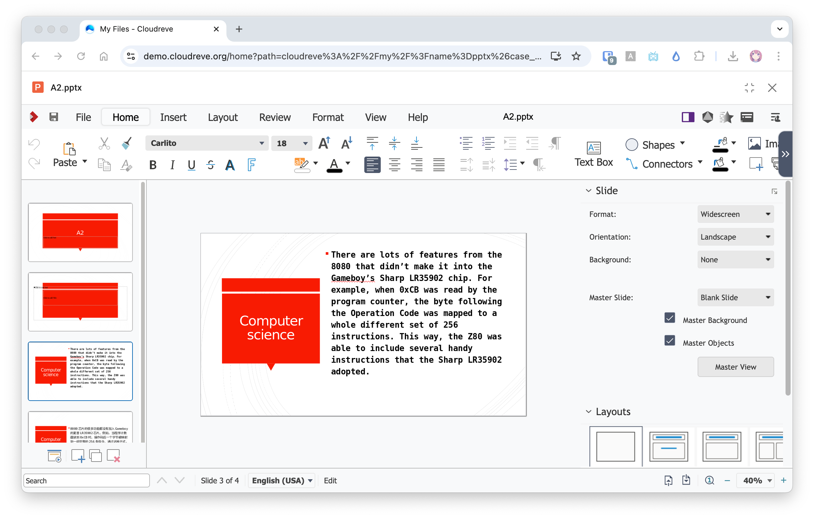
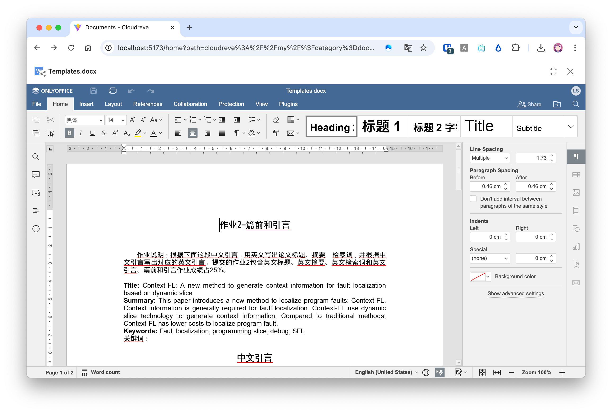

# Online Office Document Editing {#wopi}

Cloudreve supports online Office document editing and collaboration features through the WOPI protocol. This article will introduce three services that support the WOPI protocol, their deployment, and integration methods. You can also extend Cloudreve's preview and editing capabilities (not limited to Office documents) by implementing your own WOPI service.

## WOPI Protocol {#wopi-protocol}

Web Application Open Platform Interface (WOPI) is a protocol for integrating web document editors. You can read the detailed protocol definition in [Microsoft's documentation](https://learn.microsoft.com/en-us/microsoft-365/cloud-storage-partner-program/online/). Cloudreve can integrate with document processing services that implement the WOPI protocol to extend its existing document preview and editing capabilities.

### Compatibility {#wopi-compatibility}

| Method          | Support Status |
| --------------- | -------------- |
| CheckFileInfo   | ✅             |
| GetFile         | ✅             |
| Lock            | ✅             |
| RefreshLock     | ✅             |
| Unlock          | ✅             |
| PutFile         | ✅             |
| PutRelativeFile | ✅             |
| RenameFile      | ✅             |

## Setting Up WOPI Services {#wopi-service}

Please choose any one of the WOPI services for deployment.

### Collabora Online (LibreOffice Online)



Deploy Collabora Online using Docker ([official documentation](https://sdk.collaboraonline.com/docs/installation/CODE_Docker_image.html#code-docker-image)):

```bash
docker run -t -d -p 127.0.0.1:9980:9980 \
           -e "aliasgroup1=<Cloudreve address allowed to use this service, including explicit port>" \
           -e "username=<admin panel username>" \
           -e "password=<admin panel password>" \
           --name code --restart always collabora/code
```

For example, using the official demo site:

```bash
docker run -t -d -p 127.0.0.1:9980:9980 \
           -e "aliasgroup1=https://demo.cloudreve.org:443" \
           -e "username=<admin panel username>" \
           -e "password=<admin panel password>" \
           --name code --restart always collabora/code
```

After the container starts, configure Nginx or another web server to reverse proxy https://127.0.0.1:9980. You can refer to [Proxy settings](https://sdk.collaboraonline.com/docs/installation/Proxy_settings.html).

### OnlyOffice



OnlyOffice has supported the WOPI protocol since version 6.4. Please refer to the official documentation to deploy your [OnlyOffice](https://helpcenter.onlyoffice.com/) instance. It's recommended to use [Docker-DocumentServer](https://github.com/ONLYOFFICE/Docker-DocumentServer) for quick deployment.

Refer to the [official documentation](https://helpcenter.onlyoffice.com/installation/docs-developer-configuring.aspx#WOPI) to configure OnlyOffice to enable WOPI functionality. If using Docker, you can specify `WOPI_ENABLED` as `true` when creating the container:

```sh
docker run -i -t -d -p 8080:80 -e WOPI_ENABLED=true onlyoffice/documentserver
```

::: warning

OnlyOffice does not support filtering WOPI request sources. If you have public-facing requirements, please use an external application firewall to check if the `wopisrc` parameter in preview page requests is from the expected Cloudreve site.

:::

### Office Online Server (On-Prem)

[Office Online Server](https://learn.microsoft.com/en-us/officeonlineserver/office-online-server) is a privately deployable online Office document service introduced by Microsoft. Please refer to the [official documentation](https://learn.microsoft.com/en-us/officeonlineserver/deploy-office-online-server) to deploy it on your Windows Server.

You can manually access `<your OnlyOffice host>/hosting/discovery` to confirm whether it returns the expected XML response.

## Importing WOPI Editor Settings {#import-wopi-editor-settings}

Please complete the following checklist to ensure the WOPI service is available:

- Request `<your WOPI service endpoint>/hosting/discovery`, which should return an XML format response;
- Confirm that the WOPI service endpoint can be accessed by end users;
- Confirm that the `primary` site URL you set in Cloudreve `Settings` -> `Basic` -> `Site URL` can be accessed by the WOPI service in the container.

After confirming that the above checklist is correct, go to the Cloudreve admin panel's `Settings` -> `Filesystem` -> `File applications` -> `Add an application` -> `WOPI Application`, and enter `<your WOPI service endpoint>/hosting/discovery` in the `WOPI Discovery Endpoint` field to import the settings. After submission, a new group will appear in "File applications," and you can adjust the imported application name and icon as needed.
