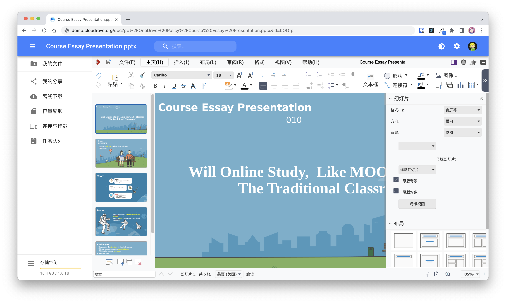

# S3 兼容

通过 AWS S3 存储策略，你可以使用 Cloudreve 对接所有兼容 AWS S3 协议的存储平台。本文将介绍 [Backblaze B2](https://www.backblaze.com/b2/cloud-storage.html) 和 [Cloudflare R2](https://www.cloudflare.com/products/r2/) 两个平台的对接方法。


S3 存储策略仅可用于自用或给受信任的群体使用。因为缺乏统一的回调机制，用户可以跳过 Cloudreve 的记录而上传文件到存储桶。


## S3 API 兼容要求

Cloudreve 利用了以下 S3 API，请确保你的存储平台兼容实现了下列 API。

### Bucket Level

* [PutBucketCors](https://docs.aws.amazon.com/AmazonS3/latest/API/API\_PutBucketCors.html) 可选，用于辅助配置 CORS 策略，如果未实现此 API，您也可以手动配置。

### Object Level

* [ListObjects](https://docs.aws.amazon.com/AmazonS3/latest/API/API\_ListObjects.html) 可选，用于后台导入外部文件。
* [CreateMultipartUpload](https://docs.aws.amazon.com/AmazonS3/latest/API/API\_CreateMultipartUpload.html)
* [CompleteMultipartUpload](https://docs.aws.amazon.com/AmazonS3/latest/API/API\_CompleteMultipartUpload.html)
* [AbortMultipartUpload](https://docs.aws.amazon.com/AmazonS3/latest/API/API\_AbortMultipartUpload.html)
* [UploadPart](https://docs.aws.amazon.com/AmazonS3/latest/API/API\_UploadPart.html)
* [GetObject](https://docs.aws.amazon.com/AmazonS3/latest/API/API\_GetObject.html)
* [DeleteObjects](https://docs.aws.amazon.com/AmazonS3/latest/API/API\_DeleteObjects.html)
* [HeadObject](https://docs.aws.amazon.com/AmazonS3/latest/API/API\_HeadObject.html)

## Backblaze B2

前往  [Backblaze B2](https://www.backblaze.com/b2/cloud-storage.html) 创建账号，点击“Create a Bucket”创建 Bucket 。可以根据自己需求选择 Public 或 Private Bucket，推荐使用 Private Bucket 以提高安全性。为存储桶取名后，其他参数保持默认，点击创建 Bucket 。

在 Cloudreve 管理面板添加 AWS S3 存储策略，填入你创建的 Bucket 名称。根据 Bucket 类型，如果是 Private 请选择“阻止全部公共访问”，Public 请选择“允许公共读取”。在 B2 管理面板找到 Bucket 的 Endpoint，在其头部追加`https://`，尾部追加 Bucket 名填入 Cloudreve：

<figure><figcaption></figcaption></figure>

在 Cloudreve 填写 Bucket 所属的区域，可以通过 Endpoint 来判断。比如 Endpoint `s3.us-west-004.backblazeb2.com` 的区域代码就是 `us-west-004`。你无法在 Cloudreve 提供的下拉菜单中找到对应地区，直接填入区域代码即可。

在 B2 面板 Account -> App Keys 中点击“Add a New Application Key”，填入任意 Key 的名称，选择刚刚创建的 Bucket，其他参数保持默认即可：

创建后，将`keyID` 填入`AccessKey`; `applicationKey`填入`SecretKey`：

<figure><figcaption></figcaption></figure>

继续填写存储策略配置，进行到第5步时，点击让 Cloudreve 帮你创建 CORS 策略：

<figure><figcaption></figcaption></figure>

至此，你就可以绑定并使用新创建的 B2 存储策略了。

## Cloudflare R2

### 选择1：Private Bucket

前往  [Cloudflare R2](https://www.cloudflare.com/products/r2/) 购买套餐开通 R2 服务。创建 Bucket 后，在 Cloudreve 管理面板添加 AWS S3 存储策略并填入创建的 Bucket 的名称，Bucket 类型选择为 “阻止全部公共访问”，填入 Cloudflare 提供的 Endpoint 地址（**需要将结尾除的 Bucket 名手动删去**），Endpoint 格式选择为“强制路径格式”：

<figure><figcaption></figcaption></figure>

在第五项 Bucket 区域代码中填入`auto`:

.png>)

进入到 R2 服务面板主页，进入“Manage R2 API Tokens”创建一组 API Token，权限选择为允许编辑，根据需求设定凭证有效期：

<figure><figcaption></figcaption></figure>


API Token 过期后请生成新的 Token 并填写到 Cloudreve 的对应存储策略中。


创建后将 AccessKey 和 SecretKey 填入 Cloudreve：

<figure><figcaption></figcaption></figure>

继续填写存储策略配置，进行到第5步时，点击让 Cloudreve 帮你创建 CORS 策略：

<figure><figcaption></figcaption></figure>

至此，你就可以绑定并使用新创建的 R2 存储策略了。

### 选择2：Public Bucket

如果您需要使用公共 Bucket，配置流程大概与 [#xuan-ze-1private-bucket](s3.md#xuan-ze-1private-bucket "mention") 相同，其中额外的操作在于：

在 R2 Bucket 设置中开启 Public Access，然后在 Cloudreve 中填写存储策略信息。其中，Bucket 类型选择为“允许公共读取”；Endpoint 格式选择为“主机名优先”；选择“使用CDN”并填入刚刚得到的 Public Bucket URL（别忘了去掉开头的`https`）：

<figure><figcaption></figcaption></figure>

其他配置与 Public Bucket 的情况保持一致即可。
