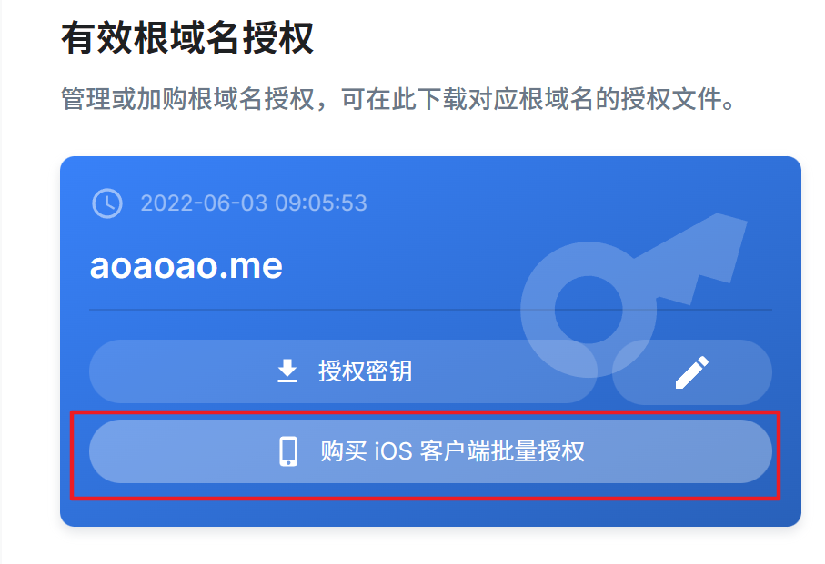
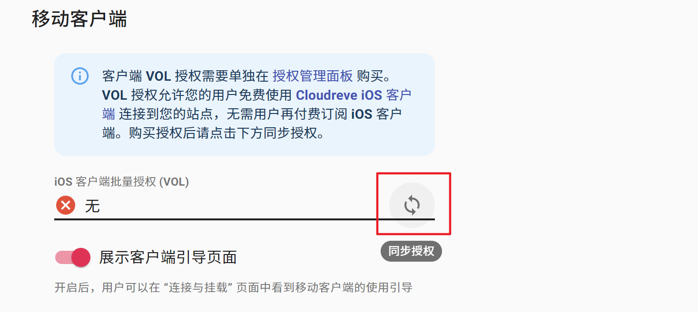

# iOS client batch authorization

### About Site Volume Licensing (VOL)

By default, [Cloudreve iOS client](https://cloudreve.org/ios) is charged for end-user subscription, after which users can connect to all Cloudreve-bound sites. Site volume authorization allows Cloudreve site administrators to unlock iOS client access for end users. After purchasing a site volume license for your site, end users can use the iOS free connection to bind your Cloudreve site without a subscription.

### price

Each root domain name: ￥398 / $63.9 (subject to the final price at the time of purchase), the authorization is permanently valid.

### Authorization conditions

* The root domain name has purchased [Cloudreve Pro](https://cloudreve.org/pro) authorization;
* Cloudreve Pro version >= 3.6.0;
* Cloudreve iOS client version >= 1.3.0

### Purchase method

1. Log in to [Cloudreve Pro Authorization Management Panel](https://cloudreve.org/login), find the root domain name that needs to unlock VOL, and click Purchase Authorization:

<figure><figcaption></figcaption ></figure>

2. After payment and purchase, go to your Cloudreve management panel, and synchronize authorization in Parameter Settings - Site Information - Mobile Client:

<figure><figcaption></figcaption ></figure>

### Precautions

* The root domain name authorized by VOL follows the root domain name authorized by Pro. After modification, the authorization needs to be re-synchronized in the Cloudreve management panel.
* VOL is a decentralized verification and cannot be refunded after purchase, please understand!
* VOL authorization can only unlock your Cloudreve site, and non-subscribers may need to pay to subscribe to the iOS client when connecting to other sites.
