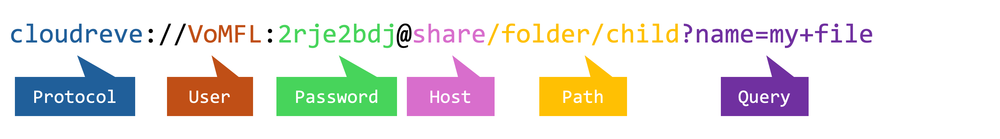

# 文件 URI

Cloudreve 使用 `文件 URI` 来定位、操作文件，或者描述文件搜索条件。

## 构成 {#structure}

Cloudreve 使用的 `文件 URI` 符合传统的 URL 标准。当对一个 `文件 URI` 视作标准 URL 进行解析时，会得到以下部分：

这一 URI 表示的意思是：使用密码 `2rje2bdj` 访问分享 ID 为 `VoMFL` 的分享链接，列出 `folder/child` 目录下所有文件名包含 `my file` 的文件。

### Protocol 协议名 {#protocol}

固定为 `cloudreve`。

### Host 主机名 - 文件系统类型 {#host}

定义了文件所在文件系统的类型。

- `my`: 我的文件；默认为当前请求认证的用户的文件，也可在 `User` 中填入其他用户的 ID 来访问其他用户的文件，比如 `cloudreve://luPa@my`，只有管理员可以通过 `my` 访问其他用户的文件。
- `shared_with_me`: 与我共享；
- `trash`: 回收站；

### User 用户名 - 文件系统 ID {#user}

Cloudreve 使用 `User` 部分来指定文件系统 ID。

- 对于 `my` 文件系统，`User` 为用户 ID，留空时为当前请求认证的用户的 ID；
- 对于 `shared_with_me` 文件系统，`User` 不能为空，为分享链接 ID；

### Password 密码 - 文件系统密码 {#password}

目前只有 `share` 文件系统使用 `Password` 部分。当分享链接为非公开时，需要通过 `Password` 部分来指定访问密码，Cloudreve 会生成密码，并直接包含在创建者得到的分享链接中。

### Path 路径 - 文件路径 {#path}

文件路径，用于指定文件在文件系统中的位置。

### Query 查询参数 - 搜索条件 {#query}

文件搜索条件，用于指定文件搜索条件，只适用于列取文件的 API。对于操作指定文件的 API（删除、更新 等），这一部分会被忽略。
