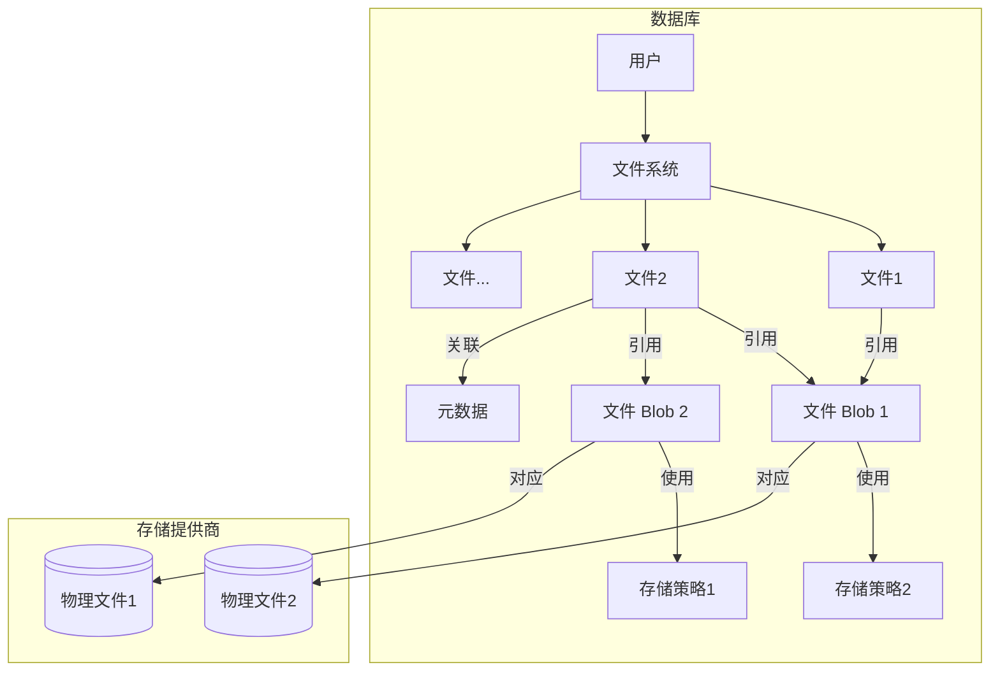
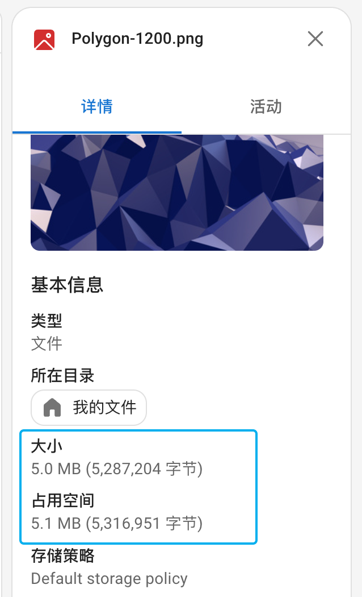

# 概念 {#concept}

Cloudreve 是一款网盘系统，在物理文件系统之上做了一层抽象，本节将介绍 Cloudreve 中的几个核心概念，了解他们有助于更好地使用 Cloudreve。

Cloudreve 的文件系统主要由 `文件`、`文件 Blob`、`元数据`、`存储策略` 和 `物理文件` 组成。其中 `文件`、`文件 Blob`、`元数据` 存放在数据库中，`物理文件` 存放在存储策略中定义的存储提供商中。一个简化的案例如下：

## 文件 {#file}

`文件` 是 Cloudreve 中用户在管理器中看到的文件，文件夹也是一种文件。

### 文件与文件 Blob {#file-and-file-blob}

一个 `文件` 可以包含一个或多个 `文件 Blob`, 实际的文件内容存储在 `文件 Blob` 中。

当一个 `文件` 启用了版本保留时，每次修改文件内容，都会生成一个新的 `文件 Blob`，之前老版本的 `文件 Blob` 仍会关联到该 `文件`，用于版本历史记录。即使版本保留没有启用，在用户更新文件内容时，Cloudreve 仍然会生成一个新的 `文件 Blob`，之后再将老版本的 `文件 Blob` 解除关联。

当一个 `文件` 生成缩略图时（仅限 Cloudreve 代理生成），Cloudreve 会将缩略图数据存储到一个缩略图 `文件 Blob`，并关联到该 `文件`。

`文件` 的“大小”指的是当前版本 `文件 Blob` 的大小。`文件` 的“占用空间”是所有关联的 `文件 Blob` 的大小之和。

### 文件与存储策略 {#file-and-storage-policy}

`文件` 也会关联一个首选的 `存储策略`：

- 对普通文件来说，它只代表着如何存储文件的新增 `文件 Blob`，并不代表已有文件的实际存储位置。
- 对文件夹来说，它代表着该目录下新文件的存储策略。如果文件夹中没有指定存储策略，则使用父目录的设置。

当首选 `存储策略` 不存在或不可用时，会回退使用用户可用的第一个 `存储策略`。

### 文件与元数据 {#file-and-metadata}

`文件` 与零到多个 `元数据` 关联，元数据中记录了文件的额外信息，比如媒体文件的信息、EXIF、缩略图状态等。

### 复制 {#copy}

当用户复制 `文件` 时，`文件` 和其关联的 `元数据` 会复制产生新的记录，但关联的 `文件 Blob` 不会复制，只会在新产生的 `文件` 中创建新的 `文件 Blob` 关联。

## 文件 Blob {#file-blob}

`文件 Blob` 代表着存储的实际数据，它通过关联 `存储策略` 和一个路径引用来对应到存储端上的一个物理文件。`文件 Blob` 是不可变（immutable）的。一个 `文件 Blob` 可以关联到多个 `文件`，比如将一个 `文件`复制多次，这些 `文件` 会共享同一组 `文件 Blob`。当 `文件 Blob` 没有被任何 `文件` 关联时，它将被视为无用状态，并最终由 Cloudreve 的队列定时回收，回收时会删除存储端上对应的物理文件。

`文件 Blob` 的类型有：版本、缩略图和 Live Photo。

## 物理文件 {#physical-file}

`物理文件` 是存储端上的实际文件，它的路径被记录在一个 `文件 Blob` 中。

## 存储策略 {#storage-policy}

`存储策略` 定义了如何存储文件、存储提供商的配置、文件的上传和下载配置。一个用户组对应着一个的 `存储策略`，用户只能使用该用户组对应的 `存储策略`。

::: info <Badge type="tip" text="Pro" />
在 Pro 版本中，一个用户组可以对应多个 `存储策略`，用户可以自由选择使用哪个 `存储策略`。
:::

## 元数据 {#metadata}

`元数据` 记录了文件的额外信息，比如媒体文件的信息、EXIF、缩略图状态等。每个元数据都关联着唯一一个 `文件`，一个 `文件` 可以有零到多个元数据。元数据包含 `名称` 和 `值` 两个字段，如果名称以 `sys:` 开头，则表示该元数据是系统元数据，无法被用户修改。

常见的记录在元数据的信息有：

- 文件的媒体信息；
- 自定义目录图表/颜色；
- 缩略图状态；
- 快捷方式文件对应的分享链接；
- 回收站中文件的原始路径；
- 回收站中文件的到期时间；
- 文件的标签

有关元数据，请参考 [元数据](../api/metadata) 章节。

元数据可用于搜索文件。

## 文件权限 {#file-permission}

文件权限定义了当此文件**处于被分享的目录中**时，其他用户对此文件的访问权限，如果未设置，会向上寻找并继承父目录的权限，直到抵达被分享的根目录。

当用户分享一个目录时，目录本身设置的权限会被忽略，因为用户在分享时设置了分享链接的权限，这一设置会覆盖目录本身的权限，但其子目录的权限设置仍然有效。

对于单文件分享，文件本身的权限设置会被忽略，而使用分享链接的权限设置。

::: tip

权限设置对于管理员用户组无效，管理员用户组总是拥有所有权限。

:::
