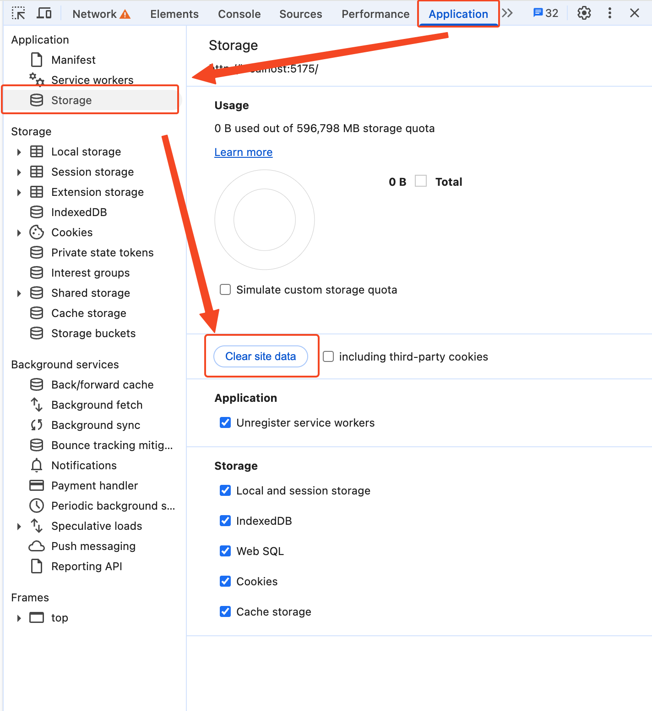

# 自定义前端 {#custom-frontend}

Cloudreve 的可执行文件中内嵌了所需要的静态资源，包括 HTML 文档、JS 脚本、CSS、图像资源等。当浏览器请求相关静态资源时，会从内嵌数据中读取并返回。本章节会介绍如果自定义这些静态资源。

::: warning

使用自定义的静态资源后，在更新 Cloudreve 时，请注意更换新构建的静态资源。

:::

## 使用自定义的静态资源 {#use}

请将[前端仓库](https://github.com/cloudreve/frontend)编译得到的 `build` 目录重命名为 `statics` 并置于 Cloudreve 同级目录下的 `data` 目录，重启 Cloudreve 后生效。启动时，Cloudreve 会在日志中打印 `Folder with xxx already exists, it will be used to serve static files.`，表示使用自定义的静态资源。

::: tip <Badge type="tip" text="Pro" />

Pro 版本用户请在授权管理面板获取前端源代码。

:::

## 提取内置的静态资源 {#eject}

您也可以在启动 Cloudreve 时加上 `eject` 子命令，将内置的静态资源提取到 `data/statics` 目录下：

```bash
./cloudreve eject
```

## 国际化 {#i18n}

Cloudreve 的国际化资源文件位于 `statics/public/locales/<语言标识>` 目录下。语言包被划分成了不同的文件，在引用时可以通过 `文件名:section.key` 的方式引用，比如：`application:login.lastStep` 对应的是 `application.json` 文件中的 `login` 分区下的 `lastStep` 键值。

### 添加新的翻译

在 `statics/public/locales` 目录下创建新的目录，目录名必须是 ISO 639-1 标准中的语言+地区标识，比如 `zh-CN`、`en-US` 等。完成翻译后，你还需要在 [`i18n.ts`](https://github.com/cloudreve/frontend/blob/master/src/i18n.ts) 中注册新的语言包：

```ts
export const languages = [
  {
    code: "en-US",
    displayName: "English",
  },
  {
    code: "zh-CN",
    displayName: "简体中文",
  },
  { // [!code ++]
    code: "zh-TW", // [!code ++]
    displayName: "繁體中文", // [!code ++]
  }, // [!code ++]
];

export default i18n;
```

修改完成后需要重新编译前端资源。

## 缓存 {#cache}

Cloudreve 会在安全上下文环境下注册 ServiceWorker 来缓存静态资源。在用户首次访问 Cloudreve 站点时，会自动请求并缓存所有静态资源。对于语言包，Cloudreve 会将其缓存在 LocalStorage 中，并在前端资源发生更新时同步更新语言包缓存。

### 清理缓存

在 ServiceWorker 已注册时，当静态资源版本发生更新时，用户会收到更新提示弹窗，并会刷新页面以获取最新资源。如果你需要手动删除缓存，请使用 <kbd>F12</kbd> 打开浏览器的 `开发者工具` -> `Application` -> `Storage` -> `Clear site data` 删除缓存。



### 排查缓存未更新

如果你在更新 Cloudreve 或静态资源后出现了下列情况：

* 用户侧未弹出更新提示弹窗；
* 用户侧看到的仍然是老版本的 UI；

请参考 [检查缓存配置](../overview/deploy/configure#check-cache) 排查问题。