# 文件浏览应用 {#file-apps}

文件浏览应用是用户使用 Web 端访问 Cloudreve 站点时，直接在浏览器内对文件进行编辑或预览的应用。Cloudreve 内置了一些常见文件的浏览应用，您也可以自由添加更多应用。

## 添加应用 {#add-app}

如果需要添加新应用，请前往 Cloudreve 管理面板的 `参数设置` -> `文件系统` -> `文件浏览应用`。

### 嵌入网页式应用 {#embed-app}

嵌入网页式应用是 Cloudreve 内置的一种应用类型，您只需要提供一个网页的 URL 即可。Cloudreve 会将文件的相关信息和临时下载 URL 通过 Query 参数传递给网页。典型的例子是 Google Docs 或 Microsoft Office 提供的公开文件预览服务。

### WOPI 协议应用 {#wopi-app}

导入兼容 WOPI 协议的文件处理服务，如 OnlyOffice 等。详情请参考 [Office 文档在线编辑](wopi)。

### 新建文件映射 {#new-file-mapping}

添加映射后，用户点击 `新建` 按钮时可以看到使用此应用的建议。

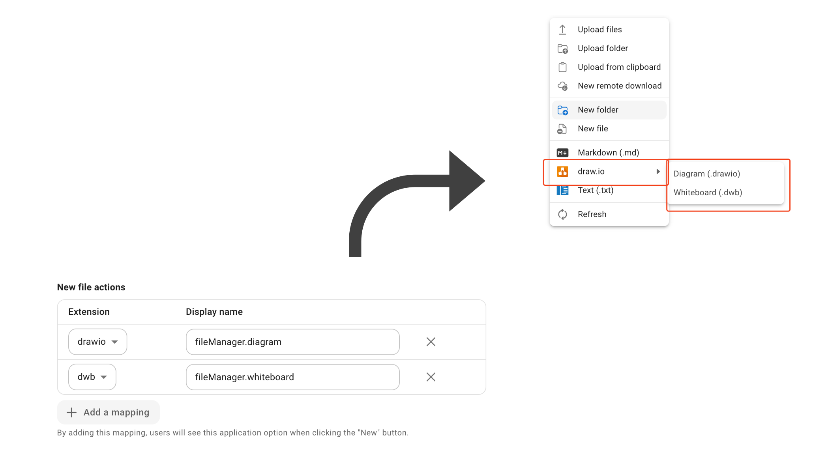

## 音乐播放器 {#music-player}

Cloudreve 内置了音乐播放器应用，其所支持的格式[取决于浏览器](https://en.wikipedia.org/wiki/HTML_audio#Supported_audio_coding_formats)。

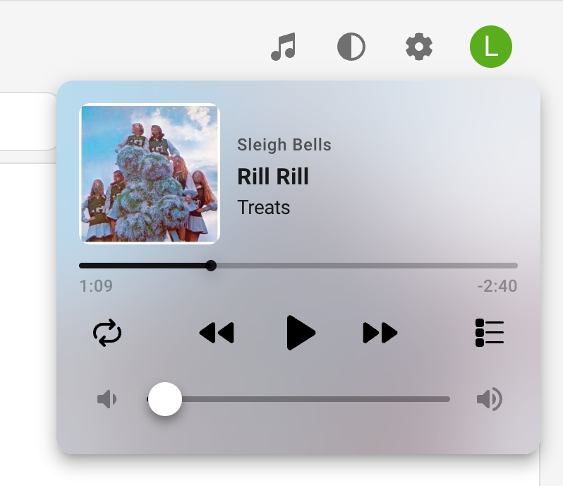

音乐播放器的某些特性可能依赖于其他功能：

- 当文件缩略图存在时，会作为专辑封面和模糊背景展示，详情请参考 [歌曲封面缩略图生成器](thumbnails#song-cover)；
- 当文件元信息中存在歌曲名、专辑、艺术家时，会优先展示；否则会展示文件名。详情请参考 [媒体信息提取](media-meta)。

## ePub 阅读器 {#epub-reader}

支持 ePub 文件电子书的阅读，阅读进度会保留在浏览器。

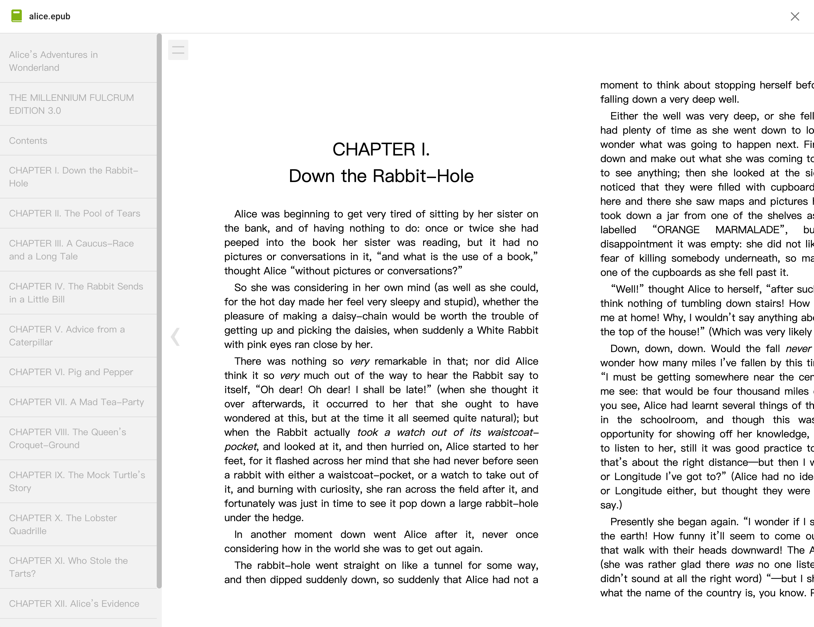

## Google Docs / Microsoft Office 在线阅读 {#google-docs-office-online}

Cloudreve 内置两种自定义应用的实例，分别是 Google 和 Microsoft 提供的公共文档的只读预览服务。如果你需要在线协同编辑功能，请参考 [Office 文档在线编辑](wopi)。

如果需要这两种公共服务，需要满足：

1. 你在 `参数设置` -> `站点信息` -> `站点 URL` 中配置的`主要站点 URL` 是公开可访问、使用了标准端口（80 或 443）的站点；
2. 你要预览的文件大小、格式符合预览服务的要求。比如 Microsoft 的预览服务要求文件大小不超过 10MB。

## PDF 阅读器 {#pdf-reader}

基于 [PDF.js](https://github.com/mozilla/pdf.js) 的 PDF 阅读器，支持 PDF 文件的阅读和标注，目前标注信息无法保存。

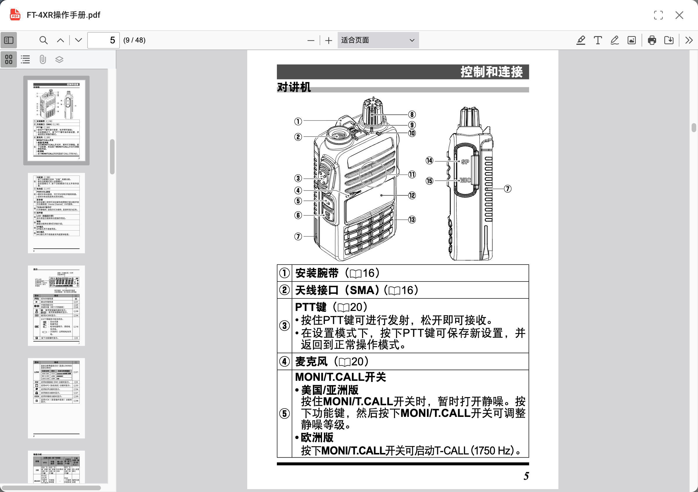

## 视频播放器 {#video-player}

Cloudreve 内置了视频播放器应用，其所支持的格式[取决于浏览器](https://en.wikipedia.org/wiki/HTML_video#Browser_support)，除此之外还支持 m3u8 播放列表。

### 外挂字幕

支持 `ass`, `srt`, `vtt` 三种格式，当视频文件目录下存在同名的字幕文件时会自动加载，你也可以手动选择。

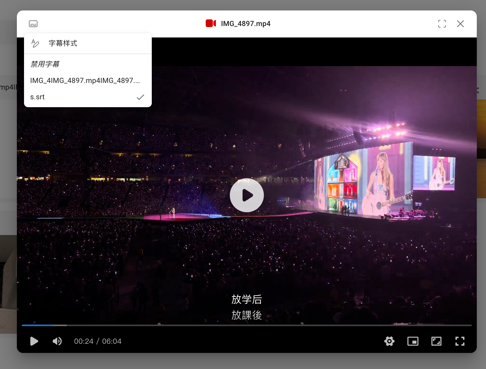

::: warning

字幕支持存在下列限制：

- 无法加载视频内嵌字幕；
- ASS 字幕的样式会丢失。

:::

### 章节

当文件媒体信息中存在章节信息时，会在进度条中展示：

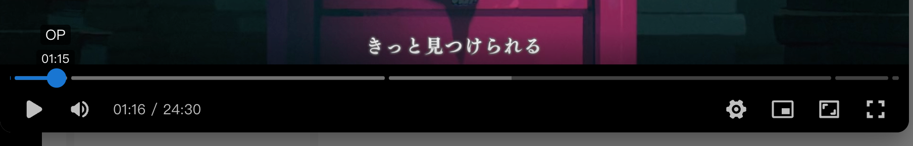

要使用此功能，你需要配置 FFprobe 媒体信息提取器，请参考 [媒体信息提取](media-meta)。

### m3u8

视频播放器通过 [hls.js](https://github.com/video-dev/hls.js) 支持 m3u8 播放列表，可用于视频清晰度切片、直播等场景。

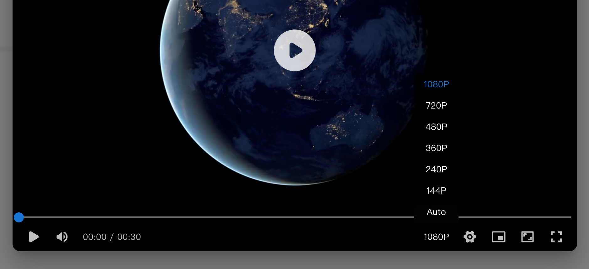

当 m3u8 文件中使用相对或绝对路径引用切片、播放列表等文件时，Cloudreve 会在播放时自动转换为请求相对于 m3u8 文件的 URL，请确保这些切片文件也上传到了 Cloudreve，并存放在正确的目录下。

::: details <Badge type="tip">案例</Badge> 通过 FFMpeg 创建多种清晰度的加密视频切片，并上传到 Cloudreve 播放。

1. 准备原始视频 `exmaple.mp4`；
2. 生成加密密钥：

   ```bash
   openssl rand 16 > enc.key
   ```

3. 将 `enc.key` 上传到你的 Cloudreve 站点，并获取直链（也可以使用其他服务）。
4. 创建一个 `enc.keyinfo` 的文件，第一行为刚才获取到的密钥直链，第二行为 `enc.key` 的本地路径，比如：

   ```
   http://cloudreve.org/f/gVVUW/enc.key
   enc.key
   ```

5. 使用 FFMpeg 创建多种清晰度的加密视频切片：

   ```bash
   ffmpeg -y -i example.mp4 -preset slow -g 48 -sc_threshold 0 -map 0:0 -map 0:1 -map 0:0 -map 0:1 -map 0:0 -map 0:1 -map 0:0 -map 0:1 -map 0:0 -map 0:1 -map 0:0 -map 0:1 -s:v:0 "1920*1080" -b:v:0 1800k -s:v:1 "1280*720" -b:v:1 1200k -s:v:2 "858*480" -b:v:2 750k -s:v:3 "630*360" -b:v:3 550k -s:v:4 "426*240" -b:v:4 400k -s:v:5 "256*144" -b:v:5 200k -c:a copy -var_stream_map "v:0,a:0,name:1080p v:1,a:1,name:720p v:2,a:2,name:480p v:3,a:3,name:360p v:4,a:4,name:240p v:5,a:5,name:144p" -master_pl_name master.m3u8 -f hls -hls_time 10 -hls_key_info_file enc.keyinfo -hls_playlist_type vod -hls_list_size 0 -hls_segment_filename "v%v/segment%d.ts" v%v/index.m3u8
   ```

6. 将 `master.m3u8` 和所有切片目录文件上传到你的 Cloudreve 站点，请保留文件目录结构。你可以使用 `目录上传` 功能上传。

播放时，Cloudreve 会自动将 `master.m3u8` 中的相对路径切片 URL 替换为实际的切片文件的临时 Blob URL，并使用 `enc.keyinfo` 中的密钥解密切片文件。

:::

## Markdown 编辑器 {#markdown-editor}

支持 Markdown 文件的编辑和预览。当文件内容不合法时，预览模式解析可能会失败，请切换到源代码模式查看。

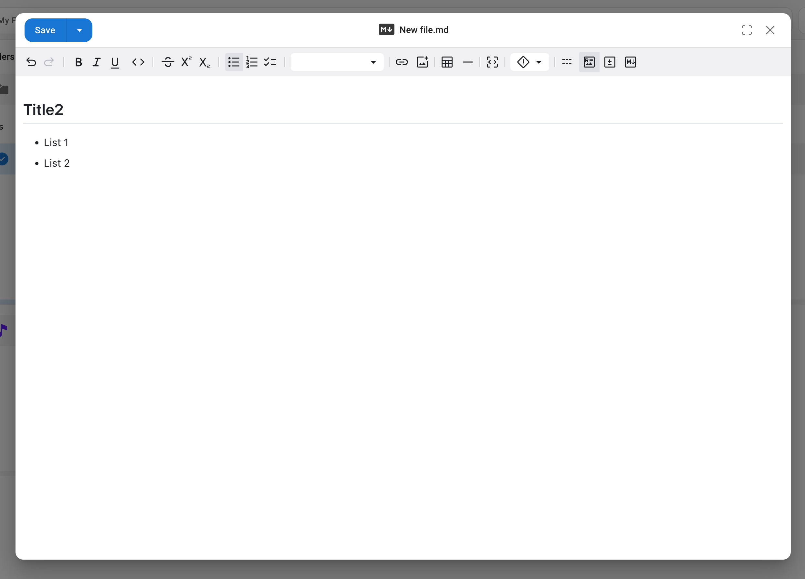

## 图片查看器 {#image-editor}

图片查看器支持图像的预览和编辑：

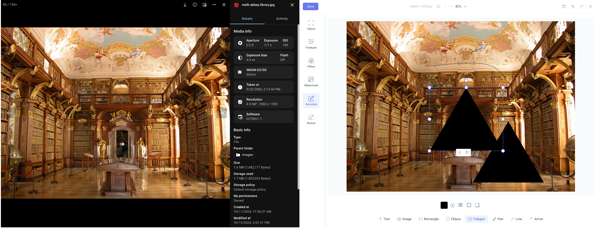

你可以通过 [媒体信息提取](media-meta) 功能获取图片的 EXIF 信息，并展示在图片查看器中。

## Draw.io {#drawio}

支持使用 Draw.io 在线编辑图表或白板，支持多人协作。

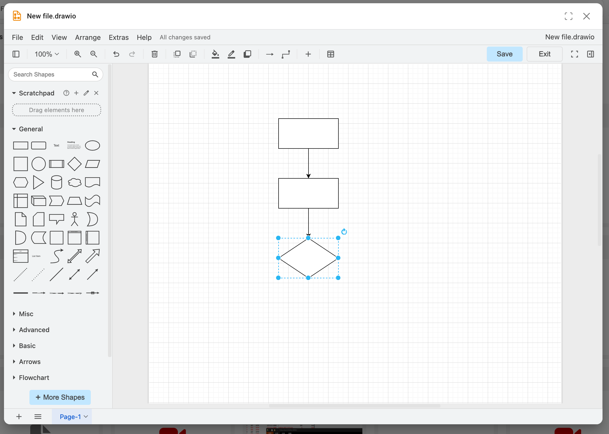

默认情况下会使用 `diagrams.net` 的在线服务，你可以在 Cloudreve 中编辑此应用，填写自建的 DrawIO 服务地址。

## 文本编辑器 {#monaco}

支持使用 Monaco 在线编辑器编辑代码，支持多种语言高亮和编码切换。

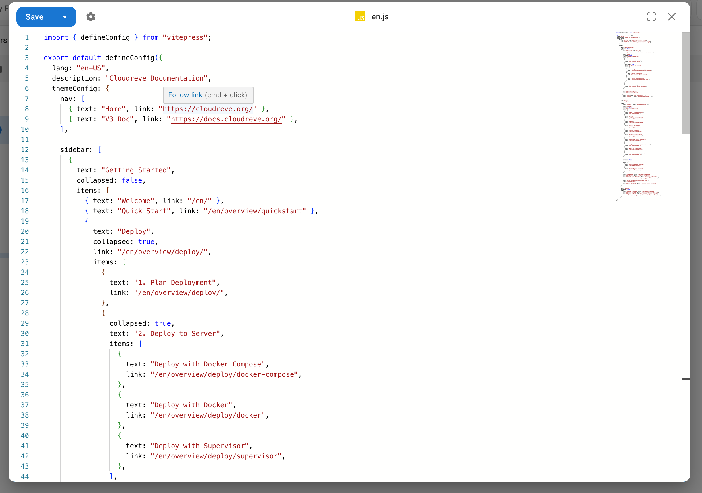

::: warning

无论你选择使用何种编码打开，或者文件原始编码如何，文件都会使用 UTF-8 编码保存。

:::

## Photopea {#photopea}

使用 Photopea 在线编辑图片、PSD 等文件。

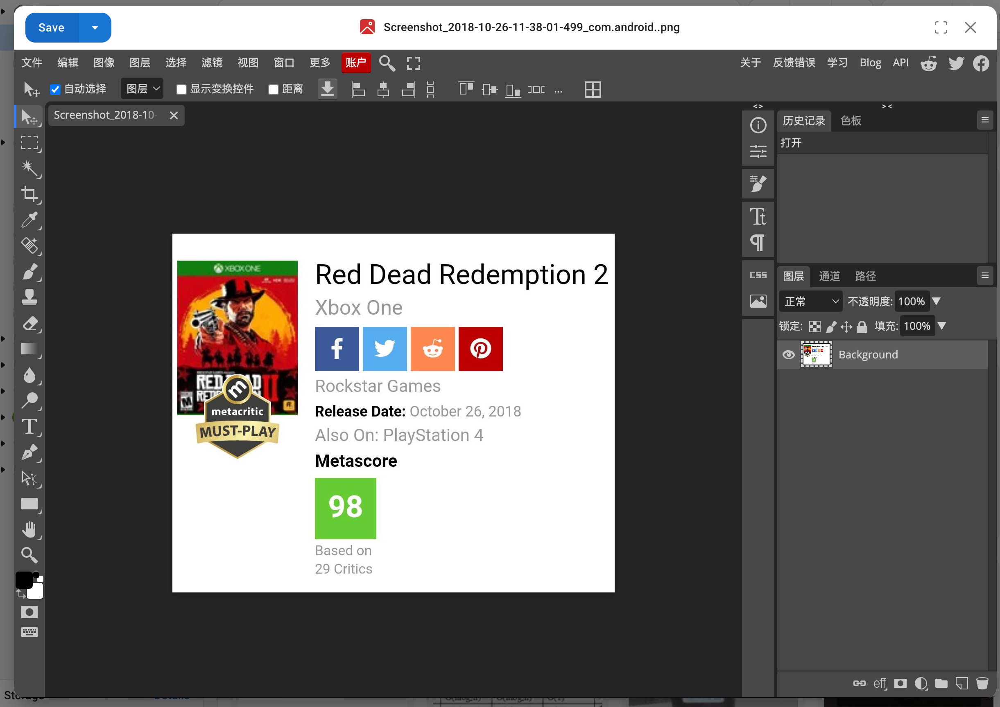

::: warning

Photopea 会使用 `https://www.photopea.com` 作为 `Referrer` 头请求文件内容，如果你配置了防盗链，请确保此请求头被允许。

:::
