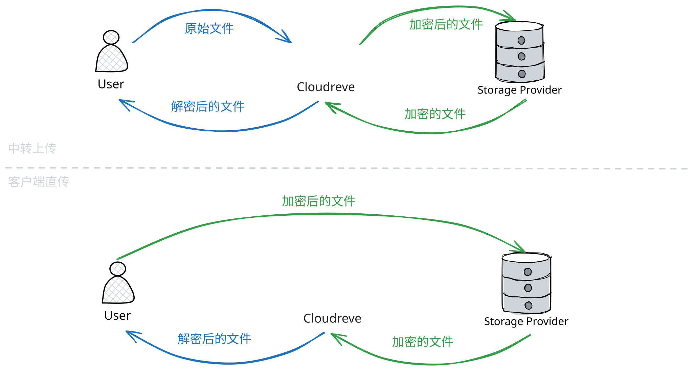

# 文件加密 {#file-encryption}

Cloudreve 支持为存储策略开启文件加密，开启后，所有新上传到该存储策略的文件都会进行加密，下载时由 Cloudreve 自动进行解密。加密存储的文件只能通过 Cloudreve 访问。

文件的加密默认在 Web 客户端完成，加密后的文件数据会直接传输到存储端；如果存储策略开启 `中转上传`，客户端只会传输原始文件到 Cloudreve，Cloudreve 会流式加密并传输存储端。

所有加密的文件的下载都需要经过 Cloudreve 中转，并由 Cloudreve 进行流式解密后返回给客户端。



## 配置 {#configure}

在存储策略配置页面，勾选 `文件加密` 即可开启文件加密。在决定为某个存储策略开启文件加密前，请确保你已经了解并检查了以下内容：

- 文件加密后只能通过 Cloudreve 访问。
- 在未开启 `中转上传` 的情况下：
  - 文件加密将由客户端完成，这一过程是非强制的，某些较早版本客户端或第三方实现可拒绝遵循加密设置，而上传原始文件。
  - 请开启并配置分片上传，以避免上传大文件前长时间等待。
  - 你的站点需要支持安全上下文 (HTTPS)。
  - 客户端上传文件时，新文件的加密密钥会被暴露给客户端。
- 开启文件加密后，存储策略原生的缩略图生成器将无法使用，推荐开启生成器代理。
- 无论是否开启 `中转下载`，下载加密的文件都会自动经过 Cloudreve 中转。

## 加密算法 {#encryption-algorithm}

Cloudreve 使用 AES-256-CTR 算法进行文件加密。每个文件 Blob 都会使用独立的密钥进行加密，对文件 Blob 的密钥使用主加密密钥进行加密，并存储在数据库中。


::: warning
默认情况下 Cloudreve 会在首次启动时随机生成主加密密钥，并存放在数据库中，这样的潜在风险是：主加密密钥和各个 Blob 的密钥都存放在同一位置，在发生安全事故时会同时泄漏。我们推荐按照下一章节的说明将主加密密钥存储在其他位置，并定期轮换。
:::

## 主加密密钥管理 {#rotate-master-encryption-key}

如果需要轮换主加密密钥，或者切换主加密密钥的存储方式，可以按照以下步骤操作：

1. 在管理面板 `文件系统` -> `参数设置` -> `文件加密` -> `主加密密钥存储方式` 中，确认当前的主加密密钥存储方式。
2. 备份数据库的 `entities` 表。
3. 通过下面的命令获取并备份当前的主加密密钥：

   ```bash
   ./cloudreve master-key get -c <你的 Cloudreve 配置文件> [--license-key <你的 Pro 授权密钥>]

   ## 比如
   ./cloudreve master-key get -c data/conf.ini --license-key xxx
   ```

   将输出的主加密密钥备份到安全的位置。

4. 选择一种方式生成新的主加密密钥：32 个随机字节，并使用 Base64 编码。

   ::: tabs
   === Cloudreve

   ```bash
   ./cloudreve master-key generate -o new.key
   ```

   === OpenSSL

   ```bash
   openssl rand -base64 32 > new.key
   ```

   :::

5. 执行下面命令，使用新的主加密密钥重新加密所有文件 Blob 的密钥：

   ```bash
   ./cloudreve master-key rotate -c <你的 Cloudreve 配置文件> -n <新的主加密密钥文件> [--license-key <你的 Pro 授权密钥>]

   ## 比如
   ./cloudreve master-key rotate -c data/conf.ini -n new.key --license-key xxx
   ```

6. 如果有需要，在 `文件系统` -> `参数设置` -> `文件加密` -> `主加密密钥存储方式` 更换主加密密钥的存储方式。
7. 根据新的存储方式，将新的主加密密钥存储到安全的位置。
   ::: tabs
   === 数据库
   无需额外操作，Cloudreve 会在第 5 步中自动将新的主加密密钥存储到数据库中。
   === 文件
   将新的主加密密钥文件存储到安全的位置。

   ```bash
   mv new.key /path/to/new.key
   ```

   在 `文件系统` -> `参数设置` -> `文件加密` -> `密钥存储路径` 中，填写新的主加密密钥文件的存储路径。

   === 环境变量
   配置启动 Cloudreve 时的环境变量，将 `CR_ENCRYPT_MASTER_KEY` 设置为新密钥的值。
   :::

8. 重启 Cloudreve 使新的主加密密钥生效。检查文件上传、下载是否正常，删除遗留的 `new.key` 文件和备份文件。
