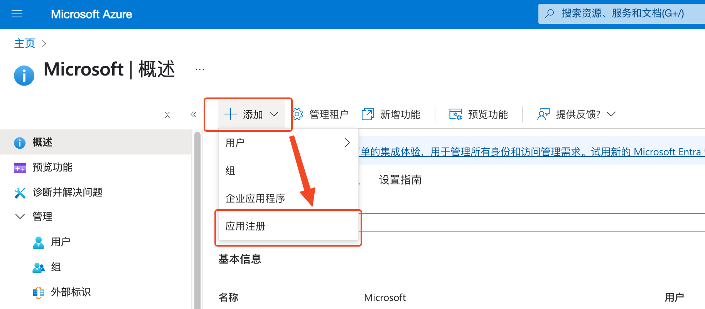
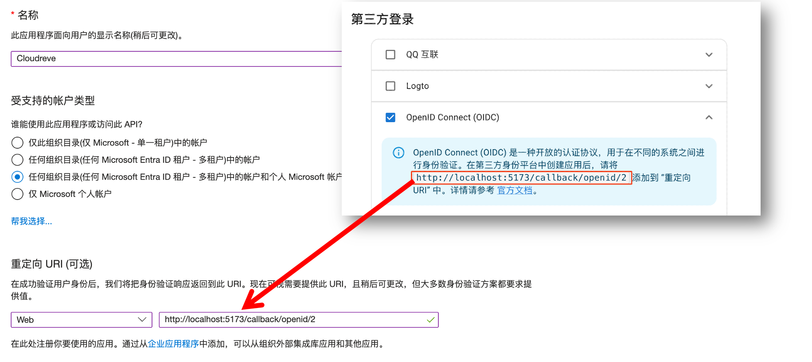
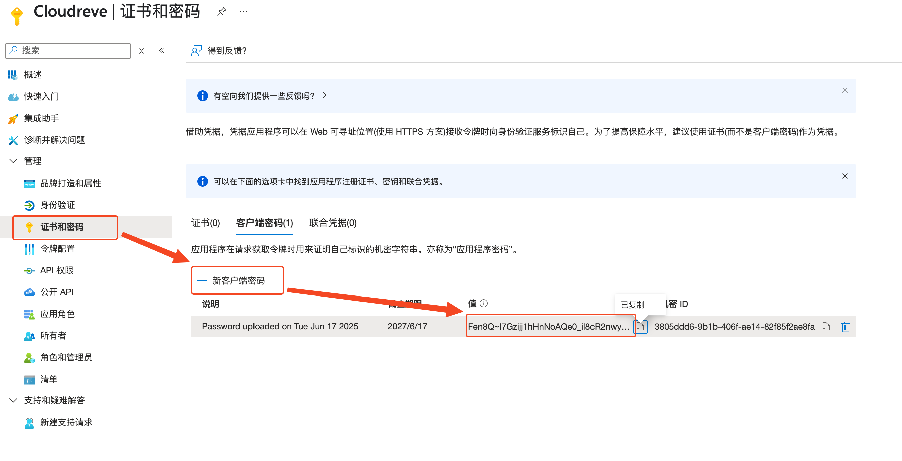
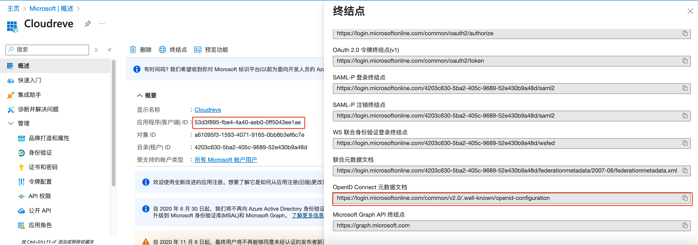
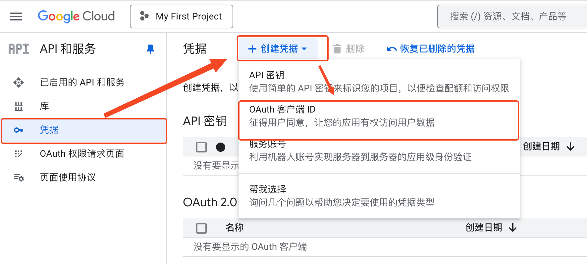
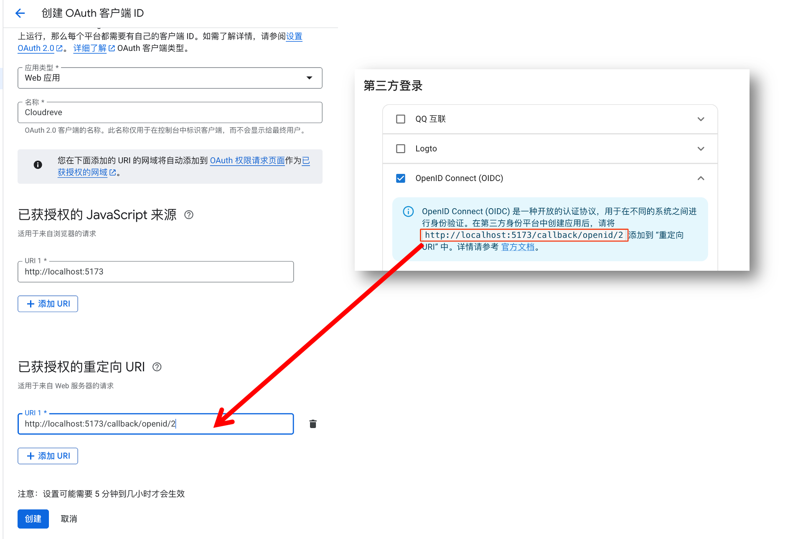
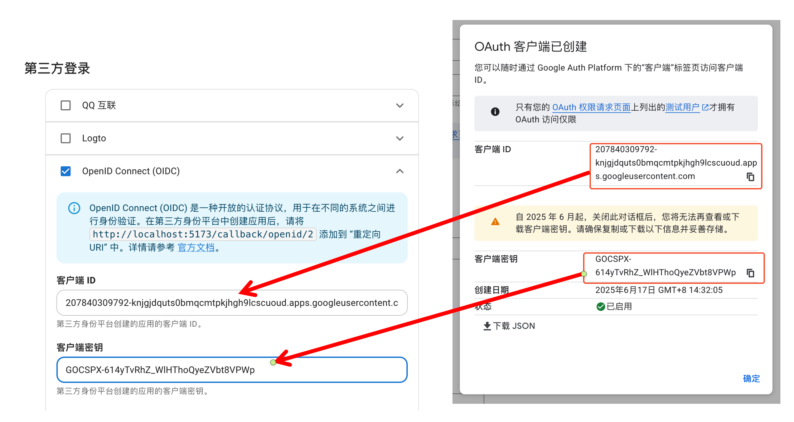

# OIDC 认证 {#oidc}

::: tip <Badge type="tip" text="Pro" />
本节只适用于 Pro 版。
:::

Cloudreve 支持对接符合 [OpenID Connect (OIDC)](https://openid.net/developers/how-connect-works/) 规范的认证服务，实现单点登录。本文将举例说明如何对接 Microsoft Entra ID (Azure AD) 和 Google 的认证服务。

## Logto {#logto}

Cloudreve 原生适配了 [Logto](https://logto.io/)，你可以直接在 Cloudreve 管理面板 `设置` -> `用户会话` -> `第三方登录` 中配置 Logto 的认证服务。

## 腾讯 QQ

Cloudreve 原生适配了 [QQ 互联](https://connect.qq.com/)，你可以直接在 Cloudreve 管理面板 `设置` -> `用户会话` -> `第三方登录` 中配置腾讯 QQ 的认证服务。

## Microsoft Entra ID (Azure AD) {#microsoft-entra-id-azure-ad}

### 创建应用注册

登录 [Azure 管理门户](https://portal.azure.com/)，在左侧导航栏中选择 `Mcrosoft Entra ID`，然后选择 `添加`, 点击 `应用注册`。

在 `名称` 字段中输入应用的名称，例如 `Cloudreve`，根据需求选择 `支持的账户类型`。转到 Cloudreve 管理面板 `设置` -> `用户会话` -> `第三方登录`，勾选 `OpenID Connect (OIDC)` 并在提示中获取重定向地址，将其填入，类型选择为 `Web`。

### 配置客户端密码

创建应用后，在左侧导航栏中选择 `证书和密码`，点击 `新建客户端密码`，输入密码名称，点击 `添加`，将得到的密码填入 Cloudreve 的 `客户端密钥` 字段中。

::: tip Important
请注意在客户端密码到期后，需要重新生成新的客户端密码，并更新到 Cloudreve 中。
:::

### 配置客户端 ID 和发现文档

回到应用的 “概况页面”，将 `应用程序(客户端) ID` 填入 Cloudreve 的 `客户端 ID` 字段中，点击 `终结点` 并复制 `OpenID Connect 元数据文档` 备用。

在 Cloudreve 的 `发现文档 (Wellknown)` 下点击 `从 URL 导入`，将上一步复制的 `OpenID Connect 元数据文档` 填入并提交。

保存设置后，即可使用 Microsoft Entra ID (Azure AD) 进行认证登录。

## Google

### 创建应用注册

登录 [Google Cloud Console](https://console.cloud.google.com/)，在左侧导航栏中选择 `API 和服务` -> `凭据`，然后选择 `创建凭据` -> `OAuth 客户端 ID`。

选择应用类型为 `Web 应用`，在 `名称` 字段中输入应用的名称，例如 `Cloudreve`。转到 Cloudreve 管理面板 `设置` -> `用户会话` -> `第三方登录`，勾选 `OpenID Connect (OIDC)` 并在提示中获取重定向地址，将其填入 `已获授权的重定向 URI`。
在 `已获授权的 JavaScript 来源` 中填写站点地址，例如 `https://cloudreve.org`。

### 配置客户端 ID 和密码

创建应用后，会弹出 `客户端 ID` 和 `客户端密钥`，将它们填入 Cloudreve 的 `客户端 ID` 和 `客户端密码` 字段中。

### 配置发现文档

在 Cloudreve 的 `发现文档 (Wellknown)` 下点击 `从 URL 导入`，将 `https://accounts.google.com/.well-known/openid-configuration` 填入并提交。

保存设置后，即可使用 Google 进行认证登录。

## OIDC 兼容情况

Cloudreve 对接的 OIDC 服务有以下基本要求：

必要要求：

- 支持使用 `client_secret_post` 方式换取 `access_token`；
- 支持 `response_type` 为 `code`；
- 支持的 `scope` 包含 `openid`, `email`, `profile`；
- 提供 `userinfo_endpoint` 用于获取用户信息；

非必要，但是推荐实现：

- `userinfo_endpoint` 中提供 Email 和头像 URL；
- 提供 `end_session_endpoint` 用于重定向用户到认证服务端退出登录；
