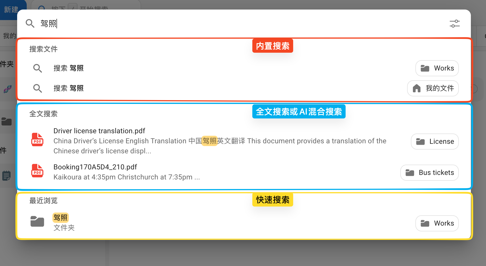

# 搜索方式 {#search-types}

Cloudreve 提供三种文件搜索方式：**内置搜索**、**全文搜索或 AI 混合搜索**、**快速搜索**。它们在搜索范围、搜索目标和配置要求上各有不同，适用于不同的使用场景。

## 对比 {#compare}

| 特性       | 内置搜索               | 全文搜索 / AI 混合搜索   | 快速搜索               |
| ---------- | ---------------------- | ------------------------ | ---------------------- |
| 搜索目标   | 文件名、文件属性       | 文件内容                 | 文件名                 |
| 搜索范围   | 我的文件、子目录、分享 | 仅我的文件               | 当前会话已加载过的文件 |
| 权限过滤   | :white_check_mark:     | -                        | -                      |
| 需要配置   | 无需额外配置           | 需外部索引和内容提取服务 | 无需额外配置           |
| 依赖服务器 | :white_check_mark:     | :white_check_mark:       | :x:                    |

## 内置搜索 {#built-in-search}

内置搜索是 Cloudreve 默认提供的搜索方式，无需额外配置即可使用。

- **搜索目标**：支持按文件名搜索，或通过文件属性（如类型、大小等）进行过滤。
- **搜索范围**：可在当前用户的"我的文件"、任意子目录以及其他用户的分享目录中搜索。
- **权限控制**：搜索结果受文件权限设置约束，用户只能搜索到有权访问的文件。
- **结果展示**：搜索结果直接在文件列表中展示。

## 全文搜索或 AI 混合搜索 {#full-text-search}

全文搜索和 AI 混合搜索允许用户检索文件的实际内容，而非仅搜索文件名。

- **搜索目标**：搜索文件内容（如文档中的文字）。
- **搜索范围**：仅限当前用户的"我的文件"目录。
- **前置条件**：需要配置第三方索引服务和内容提取服务才能启用。

::: tip
全文搜索适合需要根据文件内容定位文件的场景，例如在大量 PDF 或文档中快速查找包含特定关键词的文件。
:::

## 快速搜索 {#quick-search}

快速搜索利用当前浏览器会话缓存中已加载过的文件信息，在客户端本地进行即时搜索，无需向服务器发送请求。

- **搜索目标**：仅支持按文件名搜索。
- **搜索范围**：仅限当前浏览器会话中已加载过的文件（如刚浏览过的目录中的文件）。
- **适用场景**：快速定位最近浏览过的文件，或在当前目录下快速查找文件。

::: warning
快速搜索的结果取决于当前会话已缓存的文件数据。如果目标文件尚未在当前会话中加载过，将不会出现在搜索结果中。
:::
