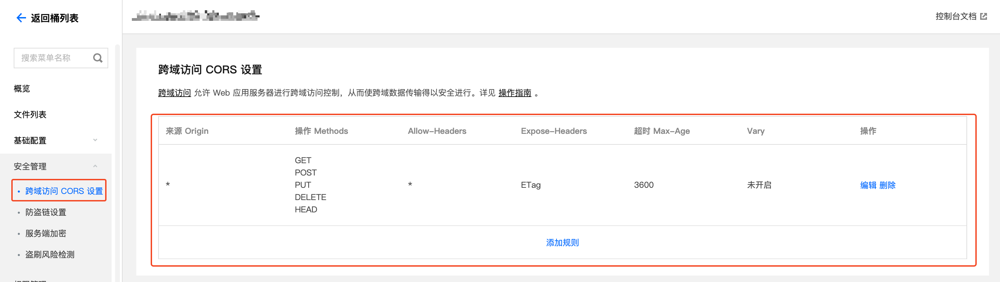

# 腾讯云 COS {#cos}

使用 [腾讯云 COS](https://cloud.tencent.com/product/cos) 存储桶存储文件。

## 配置 {#configure}

### 跨域策略 {#cors}

存储桶需要配置跨域策略后才能使用 Cloudreve 网页端上传或浏览文件。正常情况下，你可以在添加存储策略时让 Cloudreve 自动配置跨域策略。如果需要手动配置，请在 `安全管理` -> `跨域访问 CORS` 中添加。



## 使用自定义域名 Endpoint {#custom-endpoint}

如果你只需要在文件下载 URL 中使用自定义域名（如 CDN），你可以在存储策略中配置 `下载 CDN`。配置后，文件下载 URL 中的域名和路径会被替换为你所填写的 CDN 地址，但是文件上传和管理请求仍然使用的是 COS 官方提供的 Endpoint。本节会介绍如何在所有请求中都配置使用自定义 Endpoint。

### 准备自定义域名

请将自定义域名 CNAME 解析或反向代理到带有 Bucket 名称前缀的 `Endpoint`，请在 COS 存储桶配置的 `域名与传输管理` 中添加并验证此域名。

如果你不想在 COS 存储桶配置中添加你的自定义域名，你仍然可以继续，但此域名必须反向代理 `Endpoint`，直接 CNAME 解析无法使用。在配置反向代理时，请重写请求 `Host` 头为带有 Bucket 名称的官方 `Endpoint`，否则 OSS 无法识别你的 Bucket，参考配置方法如下：

::: tabs

=== Nginx

```nginx
location / {
    proxy_pass https://<bucket-name>.cos.<region>.myqcloud.com;
    proxy_set_header Host <bucket-name>.cos.<region>.myqcloud.com;
}
```

=== Caddy

```
reverse_proxy https://<bucket-name>.cos.<region>.myqcloud.com {
	header_up Host {upstream_hostport}
}
```

=== Cloudflare

你需要 `Enterprise` 计划中包含的 `Origin Rules` 来重写 `Host` 头，请参考 [Change URI Path and Host Header](https://developers.cloudflare.com/rules/origin-rules/examples/change-uri-path-and-host-header/)。

:::

### 启用自定义 Endpoint

在存储策略配置的 `基本信息` -> `Endpoint` 中填写你的自定义域名。

## 常见问题 {#faq}

::: details 上传报错 `请求失败: AxiosError: Network Error xxx`

1. 检查存储策略 `Endpoint` 设置是否正确:

   - 用户侧是否能够访问到此 Endpoint;
   - 站点如果启用了 HTTPS，请确保你填写的 Endpoint 也是 HTTPS 开头，并配置了有效的 SSL 证书;

2. 检查跨域策略是否设置，以及设置是否正确；

:::

::: details 中转上传失败，提示 `无法解析响应`

1. 展开详细错误，检查错误信息中是否含有 `413 Request Entity Too Large` 字样。

   如果有，请修改 Nginx 反代配置，设定或增大 `client_max_body_size` 的值，比如 `client_max_body_size 20000m;`。此设定值应大于上传文件的大小。

2. 检查是否有外部 WAF 防火墙拦截了上传请求。

:::

::: details 上传报错 `无法完虚文件上传：One or more of the speciried parts could not be found xxx`

这一错误的根本原因是 Cloudreve 用户端无法读取到分片上传请求中返回的 `Etag` 头。

1. 如果你的 `Endpoint` 使用了自己的反代服务器，检查是不是反代时将 `Etag` 头过滤掉了。
2. 某些用户侧的防火墙（如 TPLink 路由器）会过滤掉 `Etag` 头，请检查防火墙配置。

:::

::: details 下载 CDN 使用绑定至存储桶的域名后，下载文件报错 `InvalidAccessKeyId`?

在 COS 存储桶设置添加自定义 CDN 加速域名时，检查你是否开启了 `回源鉴权`:

- 如果开启了，通过 CDN 下载文件时不再需要签名，请在 Cloudreve 存储策略设置中勾选 `下载` -> `下载 CD` -> `不为 CDN 签名文件 URL`;
- 如果并未开启，请检查你的 CDN CNAME 是否配置正确、存储策略凭证填写是否正确；

:::

<!--@include: ./parts/refer-photopea.md-->
