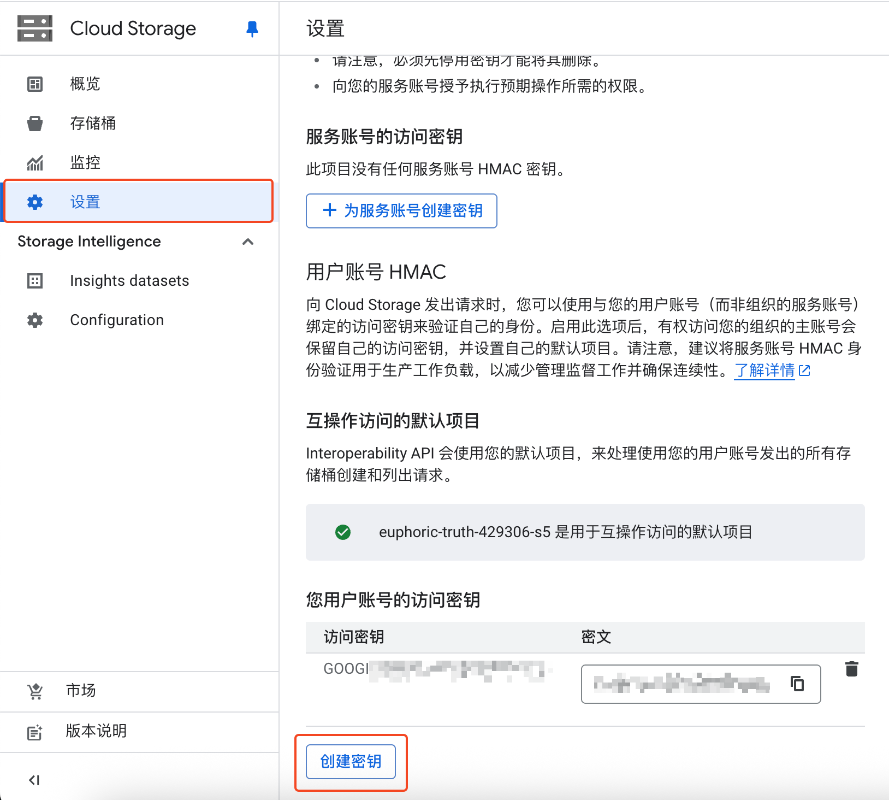
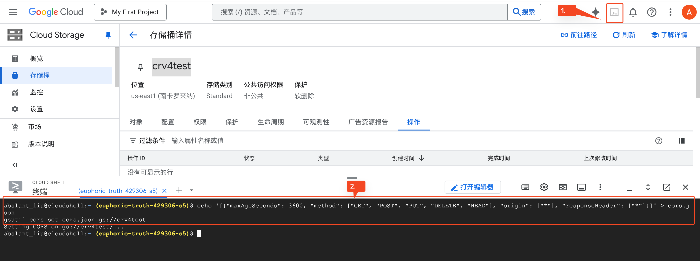

# Google Cloud Storage (S3 兼容) {#gcs}

使用 [Google Cloud Storage](https://cloud.google.com/storage) 配合 S3 兼容存储策略存储文件。

## 配置 {#configure}

### 创建存储桶和访问凭证

在 Google Cloud Console 中创建一个存储桶，然后前往 `设置` -> `互操作性` -> `用户账号 HMAC`，创建一组访问密钥：



在 Cloudreve 创建一个 `S3 兼容` 存储策略，按照下面规则填写信息：

- 存储策略中的 `Bucket 名称` 填写刚刚创建的存储桶名称；
- 存储策略中的 `Endpoint` 填写 `https://storage.googleapis.com`；
- 存储策略中的 `地区代码` 填写为 `auto`；
- 存储策略中的 `访问凭证` 填写为刚刚创建的访问密钥的 `访问密钥` 和 `密文`；

### 配置跨域策略

存储桶需要配置跨域策略后才能使用 Cloudreve 网页端上传或浏览文件。Google Cloud Storage 不支持一键配置跨域策略，需要手动配置。下面为参考跨域配置文件：

```json
[
  {
    "maxAgeSeconds": 3600,
    "method": ["GET", "POST", "PUT", "DELETE", "HEAD"],
    "origin": ["*"],
    "responseHeader": ["*"]
  }
]
```

在 Google Cloud 控制台左上角打开一个 Cloud Shell 窗口，执行以下命令：

```bash
echo '[{"maxAgeSeconds": 3600, "method": ["GET", "POST", "PUT", "DELETE", "HEAD"], "origin": ["*"], "responseHeader": ["*"]}]' > cors.json
gsutil cors set cors.json gs://你的存储桶名
```



详细操作文档请参考 [设置和查看 CORS 配置](https://cloud.google.com/storage/docs/using-cors?hl=zh-cn)。

## 常见问题 {#faq}

::: details 上传报错 `请求失败: AxiosError: Network Error`

1. 检查用户是否能够连接到 `storage.googleapis.com`；
2. 检查存储桶跨域策略是否设置，以及设置是否正确；

:::

::: details 上传报错 `分片上传失败: Invalid argument.`

检查 `设置` -> `文件系统` -> `上传会话有效期 (秒)`, 其值应小于 `864000`。

:::

::: details 中转上传失败，提示 `无法解析响应`

1. 展开详细错误，检查错误信息中是否含有 `413 Request Entity Too Large` 字样。

   如果有，请修改 Nginx 反代配置，设定或增大 `client_max_body_size` 的值，比如 `client_max_body_size 20000m;`。此设定值应大于上传文件的大小。

2. 检查是否有外部 WAF 防火墙拦截了上传请求。

:::
