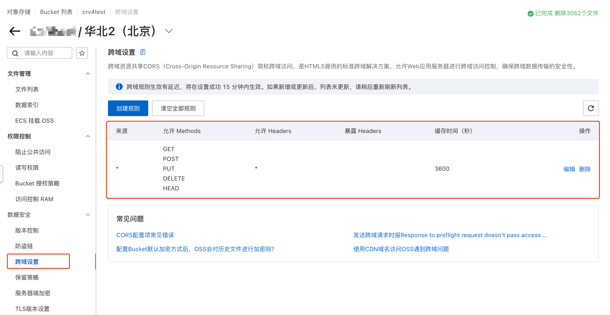
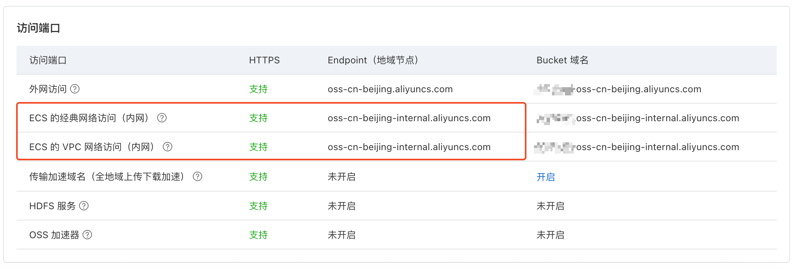

# 阿里云 OSS {#oss}

使用 [阿里云 OSS](https://www.aliyun.com/product/oss) 存储桶存储文件。

## 配置 {#configure}

### 跨域策略 {#cors}

存储桶需要配置跨域策略后才能使用 Cloudreve 网页端上传或浏览文件。正常情况下，你可以在添加存储策略时让 Cloudreve 自动配置跨域策略。如果需要手动配置，请在 `数据安全` -> `跨域设置` 中添加。



### 内网 Endpoint {#internal-endpoint}

如果你的 Cloudreve 部署在阿里云计算服务中，并且与 OSS 处在同一可用区下，你可以额外指定使用内网 EndPoint 以节省流量开支, Cloudreve 会在条件满足时切换到内网 EndPoint 发送请求。



为存储策略配置内网 Endpoint 时，下列场景会切换到内网 Endpoint：

- 服务端转存上传文件；
- 服务端中转上传（当存储策略开启 `中转上传` 时）；
- 文件管理请求（删除、创建上传会话等）；
- 服务端中转下载（当存储策略开启 `下载中转` 时）；
- 其他需要服务端下载文件的请求；

当使用从机节点处理任务时，会强制使用非内网 Endpoint。

## 使用自定义域名 Endpoint {#custom-endpoint}

如果你只需要在文件下载 URL 中使用自定义域名（如 CDN），你可以在存储策略中配置 `下载 CDN`。配置后，文件下载 URL 中的域名和路径会被替换为你所填写的 CDN 地址，但是文件上传和管理请求仍然使用的是 OSS 官方提供的 Endpoint。本节会介绍如何在所有请求中都配置使用自定义 Endpoint。

### 准备自定义域名

请将自定义域名 CNAME 解析或反向代理到带有 Bucket 名称前缀的 `Bucket 域名`，请在 OSS 存储桶配置的 `Bucket 配置` -> `域名管理` 中添加并验证此域名。

如果你不想在 OSS 存储桶配置中添加你的自定义域名，你仍然可以继续，但此域名必须反向代理 `Bucket 域名`，直接 CNAME 解析无法使用。在配置反向代理时，请重写请求 `Host` 头为带有 Bucket 名称的官方 `Bucket 域名`，否则 OSS 无法识别你的 Bucket，参考配置方法如下：

::: tabs

=== Nginx

```nginx
location / {
    proxy_pass https://<bucket-name>.oss-<region>.aliyuncs.com;
    proxy_set_header Host <bucket-name>.oss-<region>.aliyuncs.com;
}
```

=== Caddy

```
reverse_proxy https://<bucket-name>.oss-<region>.aliyuncs.com {
	header_up Host {upstream_hostport}
}
```

=== Cloudflare

你需要 `Enterprise` 计划中包含的 `Origin Rules` 来重写 `Host` 头，请参考 [Change URI Path and Host Header](https://developers.cloudflare.com/rules/origin-rules/examples/change-uri-path-and-host-header/)。

:::

::: warning
无论是反代还是 CNAME 解析，目标 Endpoint 都是带有 Bucket 名称的 `Bucket 域名`，不要错填成不带 Bucket 名称前缀的 `Endpoint`。
:::

### 启用自定义 Endpoint

在存储策略配置的 `基本信息` -> `Endpoint` 中填写你的自定义域名，并勾选 `这是一个自定义域名` 选项。

## 常见问题 {#faq}

::: details 上传报错 `无法完成文件上传: Private address is forbidden to callback. (InvalidArgument)`

请检查 `参数设置` -> `站点信息` -> `站点 URL` 中 `主要` 站点 URL 是否正确，必须为公网可以访问的地址。

:::

::: details 上传报错 `无法完成文件上传: xxxxx (CallbackFailed)`

这一报错说明 OSS 无法请求你的回调地址。请检查 `参数设置` -> `站点信息` -> `站点 URL` 中 `主要` 站点 URL 是否正确，必须为公网可以访问的地址。

在报错中，`xxxx` 为请求回调地址时具体的报错信息，请根据报错信息进行排查。

:::

::: details 上传报错 `无法创建上传会话: xxxxx The bucket you are attempting to access must be addressed using the specified endpoint. Please send all future requests to this endpoint`

1. 检查存储策略中 `Endpoint` 设置，避免使用官方 Endpoint 的情况下仍然勾选 `这是一个自定义域名`;
2. 如果正在使用自定义 Endpoint：
   - 请检查其指向的是否为带有 Bucket 名称的 `Bucket 域名`，而不是官方 `Endpoint`;
   - 请检查是否在 OSS 存储桶配置中添加并验证了了该自定义域名; 或者在反代配置中是否正确重写了 `Host` 头;

:::
