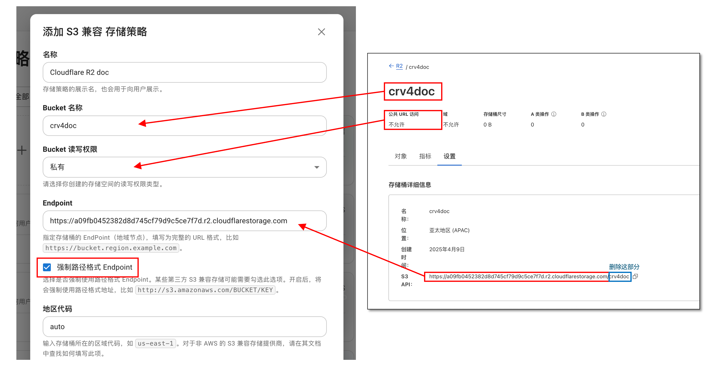
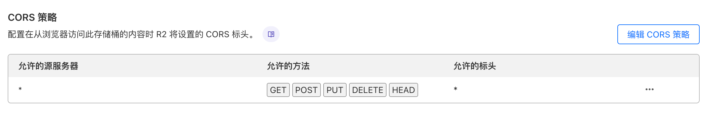

# Cloudflare R2 (S3 兼容) {#r2}

使用 [Cloudflare R2](https://www.cloudflare.com/products/r2/) 配合 S3 兼容存储策略存储文件。

## 配置 {#configure}

在 Cloudflare 面板创建一个 R2 存储桶，转到设置，获取存储桶信息并填写到存储策略中：



- 存储策略中的 `Bucket 名称` 填写刚刚创建的存储桶名称；
- 存储策略中的 `Endpoint` 填写将 R2 给出的 `S3 API` 地址的结尾的存储桶名称删除后的地址；
- 勾选 `强制路径格式 Endpoint`；
- 存储策略中的 `地区代码` 填写为 `auto`；

在 Cloudflare R2 存储桶列表，`API` -> `管理 API 令牌`，创建一个 API 令牌，`权限` 选择为 `管理员读和写`，获取 `访问密钥 ID` 和 `机密访问密钥` 填写到存储策略的 `访问凭证` 中。

### 跨域策略

存储桶需要配置跨域策略后才能使用 Cloudreve 网页端上传或浏览文件。正常情况下，你可以在添加存储策略时让 Cloudreve 自动配置跨域策略。如果需要手动配置，请在 R2 存储桶 `设置` -> `CORS 策略` 中添加。

```json
[
  {
    "AllowedOrigins": ["*"],
    "AllowedMethods": ["GET", "POST", "PUT", "DELETE", "HEAD"],
    "AllowedHeaders": ["*"],
    "ExposeHeaders": ["ETag"],
    "MaxAgeSeconds": 3600
  }
]
```



## 使用公开访问的存储桶 {#public-access}

::: warning 警告

使用公开访问的存储桶时，任何人都可以不经授权访问你的文件。

:::

如需使用公开访问的存储桶，请在 R2 存储桶设置中开启 `公开访问` 选项，并绑定自定义域。然后在存储策略设置中:

- 开启 `使用 CDN 加速下载`，将你绑定的自定义域名填写到 `CDN 加速域名` 中。
- **取消勾选** `强制路径格式 Endpoint`；

## 反向代理私有存储桶下载请求 {#reverse-proxy}

如果你需要反向代理使用私有存储桶下载请求，请在存储策略设置中开启 `使用 CDN 加速下载`，将你配置的反向代理域名填写到 `CDN 加速域名` 中。

在配置反向代理时，请注意以下几点：

- 反代目标是 R2 提供的**不含** Bucket 名称的 Endpoint，比如 `https://a02xxxxxxxxx.r2.cloudflarestorage.com`；
- 在上游请求中需要覆盖 `Host` 头，比如 `Host: a02xxxxxxxxx.r2.cloudflarestorage.com`；

以 Caddy 为例，配置如下：

```text
reverse_proxy {
    to https://a09xxxxxxxxxxx.r2.cloudflarestorage.com
    header_up Host a09xxxxxxxxxxx.r2.cloudflarestorage.com
}
```

## 常见问题 {#faq}

::: details 上传报错 `请求失败: AxiosError: Network Error`

1. 检查存储策略 `Endpoint` 设置是否正确:
2. 检查跨域策略是否设置，以及设置是否正确；
3. 检查 `设置` -> `文件系统` -> `上传会话有效期 (秒)`, 其值应小于 `864000`。

:::

::: details 中转上传失败，提示 `无法解析响应`

1. 展开详细错误，检查错误信息中是否含有 `413 Request Entity Too Large` 字样。

   如果有，请修改 Nginx 反代配置，设定或增大 `client_max_body_size` 的值，比如 `client_max_body_size 20000m;`。此设定值应大于上传文件的大小。

2. 检查是否有外部 WAF 防火墙拦截了上传请求。

:::

::: details 上传报错 `无法创建上传会话: 未知错误 (failed to create multipart upload: AccessDenied: Access Denied`

检查存储策略 `访问凭证` 是否正确，此令牌须拥有 `管理员读和写` 权限。

:::
