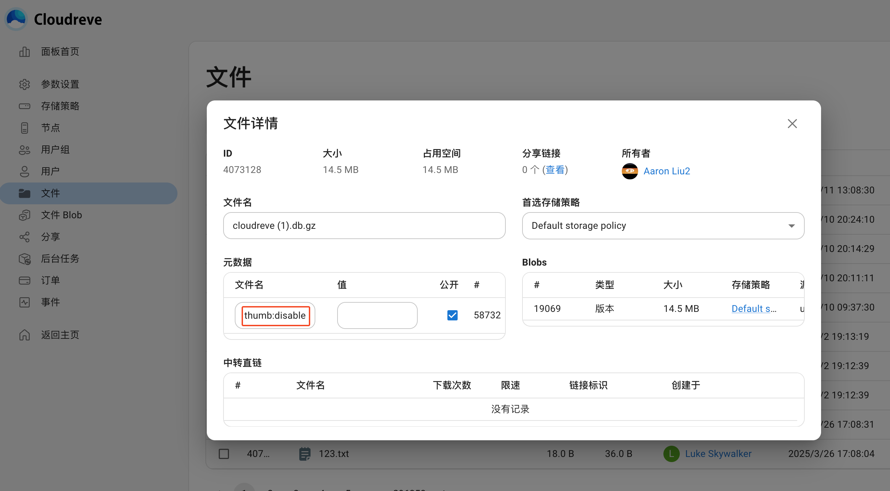

# 缩略图 {#thumbnails}

Cloudreve 支持使用多种缩略图生成器，为不同类型的文件生成缩略图，包括图像、视频、Office 文档。您也可以借助“缩略图代理”功能扩展原本不支持缩略图生成的存储策略。

## 生成逻辑 {#thumbnail-generation-logic}

### 何时生成 {#when-to-generate}

Cloudreve 不会在文件上传后立即尝试为其生成缩略图，而是在尝试加载缩略图时生成。这一小节描述了 Cloudreve 会在何时决定加载缩略图。对于每个文件，其缩略图的状态可分为以下两种：

- `未知` 新文件上传后的默认状态。在文件列表查看此文件时，Cloudreve 会尝试加载或生成缩略图。
  - 如果已有缩略图文件 Blob，直接使用该 Blob 作为缩略图。
  - 如果缩略图文件 Blob 不存在，则尝试生成缩略图。
- `缩略图不存在` 在文件列表查看此文件时，Cloudreve 不会展示缩略图。

在下列情况下，文件的缩略图状态会被重设为 `未知`：

- 文件被重命名且文件的扩展名发生变化；
- 文件内容被更新。

在下列情况下，文件的缩略图状态会被重设为 `缩略图不存在`：

- 没有可用的缩略图生成器；
- 缩略图生成器生成缩略图失败。

### 如何生成

这一小节描述了 Cloudreve 如何为文件生成缩略图。Cloudreve 支持多种缩略图生成器，在生成缩略图时会按照“流水线”模式依此尝试每个生成器，直到有生成器成功返回了缩略图。目前支持的生成器及其尝试顺序如下表所示：

<div style="overflow-x: auto">
  <table>
    <thead>
      <tr>
        <th>生成器</th>
        <th>描述</th>
        <th>不支持的存储策略</th>
        <th width="156">优先级（高到低）</th>
      </tr>
    </thead>
    <tbody>
      <tr>
        <td>存储策略原生</td>
        <td>
          使用第三方存储策略原生接口生成缩略图，不会产生缩略图 Blob，只会产生缩略图的
          URL 以供重定向。
        </td>
        <td>本机、S3</td>
        <td>1</td>
      </tr>
      <tr>
        <td>歌曲封面</td>
        <td>
          无第三方依赖，Cloudreve 内置。从 MP3 (ID3v1, 2.x), MP4 (ACC, M4A, ALAC), OGG 或 FLAC 中提取专辑封面。这一生成器依赖于任一其他图像生成器（Cloudreve 内置 或
          VIPS），以用于压缩提取后的封面图像。源文件位于第三方存储端时，会尝试使用 Range
          请求下载必要部分数据，无需完整下载文件。
        </td>
        <td>除了本机存储外，所有未开启“生成器代理”的其他类型存储策略。</td>
        <td>2</td>
      </tr>
      <tr>
        <td>LibreOffice</td>
        <td>
          使用 LibreOffice 生成 Office
          文档的缩略图。这一生成器依赖于任一其他图像生成器（Cloudreve 内置 或
          VIPS）。源文件位于第三方存储端时，会完整下载源文件。
        </td>
        <td>除了本机存储外，所有未开启“生成器代理”的其他类型存储策略。</td>
        <td>3</td>
      </tr>
      <tr>
        <td>VIPS</td>
        <td>使用 libvips 处理缩略图图像，支持更多图像格式，资源消耗更低。源文件位于第三方存储端时，会完整下载源文件。</td>
        <td>除了本机存储外，所有未开启“生成器代理”的其他类型存储策略。</td>
        <td>4</td>
      </tr>
      <tr>
        <td>FFmpeg</td>
        <td>
          使用 FFmpeg 生成视频缩略图。源文件位于第三方存储端时，会尝试使用 Range
          请求下载必要部分数据，无需完整下载文件。
        </td>
        <td>除了本机存储外，所有未开启“生成器代理”的其他类型存储策略。</td>
        <td>5</td>
      </tr>
      <tr>
        <td>Cloudreve 内置</td>
        <td>
          无第三方依赖，使用 Cloudreve 内置的图像处理能力，仅支持 PNG、JPEG、GIF
          格式的图片。源文件位于第三方存储端时，会完整下载源文件。
        </td>
        <td>除了本机存储外，所有未开启“生成器代理”的其他类型存储策略。</td>
        <td>6</td>
      </tr>
    </tbody>
  </table>
</div>

有关各个生成器的详细介绍在后续章节中。

### 代理生成缩略图 {#thumbnail-proxy}

默认情况下，所有非本机存储策略只支持使用存储策略原生生成器，这一生成器速度最快，但支持的文件格式有限，某些存储策略（如 S3）甚至根本不支持缩略图生成。你可以在 `存储策略设置` -> `缩略图` -> `代理生成缩略图` 开启代理生成缩略图功能。开启后，如果原生生成器无法产生缩略图，Cloudreve 会尝试使用已配置的生成器流水线，再将生成的缩略图回传到存储策略。

## 生成器

### 存储策略原生

使用存储策略原生的图像处理服务生成缩略图，你可以在 `存储策略设置` -> `缩略图` 中设置要使用的扩展名和文件大小限制。不同存储提供商支持的文件格式不同，请参考存储提供商的文档。

::: tip

对于从机存储策略，你可以参考 [原生缩略图](./storage/remote#native-thumbnail) 章节扩展原生缩略图能力。

:::

### 歌曲封面 {#song-cover}

无需安装第三方库，从 MP3 (ID3v1, 2.x), MP4 (ACC, M4A, ALAC), OGG 或 FLAC 中提取专辑封面。需要依赖于其他任一支持图片的生成器（VIPS 或者 Cloudreve 原生）。

### LibreOffice

主页：[https://www.libreoffice.org/discover/libreoffice/](https://www.libreoffice.org/discover/libreoffice/)

此生成器可以为 Office 文档生成缩略图，需要依赖于其他任一支持图片的生成器（VIPS 或者 Cloudreve 原生）。

以 Ubuntu 为例，安装 LibreOffice：

```sh
sudo apt install libreoffice
```

### VIPS

主页：[https://www.libvips.org/](https://www.libvips.org/)

以 Ubuntu 为例：

```sh
sudo apt install libvips-tools
```

Cloudreve 仅支持 8.5 或更新的 libvips，你可以通过如下命令确认安装的版本：

```sh
vips -v
```

某些较老发行版的包管理器中无最新版本的 libvips，推荐从源代码编译安装最新版：[https://www.libvips.org/install.html](https://www.libvips.org/install.html)

### FFMpeg {#ffmpeg}

主页：[https://ffmpeg.org](https://ffmpeg.org/)

以 Ubuntu 为例：

```shell
sudo apt install ffmpeg
```

### Cloudreve 内置

可直接生成常见图像（PNG、JPEG、GIF）的缩略图。

## 排查缩略图不显示 {#troubleshoot-thumbnail-not-displayed}

如果你已经配置了相应的缩略图生成器，但缩略图仍然不展示，可参开此章节依次进行排查。

### 确认缩略图状态

确认文件的缩略图状态是否被标记为 `缩略图不存在`。请在后台找到此文件，检查 `元数据` 中是否存在 `thumb:disabled`：



如果存在，说明上次缩略图生成失败，导致此文件被标记为 `缩略图不存在`。你可以移除 `thumb:disabled` 元数据，或者将文件重命名为其他扩展名，再重命名回原扩展名来重置缩略图状态。

重置完毕后，刷新浏览器页面（注意不是刷新文件列表），查看缩略图是否展示。

### 确认是否使用了原生缩略图生成器

转到此文件所属的存储策略设置，检查 `缩略图` 下关于原生缩略图的设置，确定此文件的扩展名和大小是不是满足了原生缩略图的条件：

- 如果满足，则说明原生缩略图生成器被使用，但缩略图仍然不展示，请检查存储提供商的配置：比如是否开启了对应的图像处理服务，或者存储提供商是否真的支持此文件格式。
- 如果不满足，检查是否启用了生成器代理：
  - 如果未启用，缩略图不展示为预期结果，因为没有可用的生成器；
  - 如果已启用，转到 `参数设置` -> `媒体处理` -> `缩略图生成器` 检查是否有能够处理此文件的生成器。
    - 如果不存在，说明没有可用的生成器，缩略图不展示为预期结果；
    - 如果存在，继续后续排查流程

### 检查缩略图生成器

缩略图生成器可能因为各种原因无法正常工作。前往管理面板的 `事件` 列表，过滤 `缩略图生成` 类型的事件。找到对应文件的缩略图生成事件，检查事件中记录的错误信息：


::: tip

你也可以 [开启 Debug 模式](../overview/configure#debug-mode)，然后重新触发缩略图生成，查看 Cloudreve 输出的日志信息。

:::

### 检查缩略图 Blob

如果缩略图生成器正常工作，但缩略图仍然不展示，请检查缩略图 Blob 是否存在。查看文件的详细信息，在 `数据` 下会给出缩略图 Blob 的大小。如果缩略图 Blob 存在，可能是存储策略原因导致无法加载缩略图。请参考具体存储策略的文档排查文件下载故障。

## 生成队列 {#thumbnail-queue}

所有非原生缩略图生成请求都经由一个队列进行管理。你可以前往管理面板的 `参数设置` -> `队列` -> `缩略图生成` 设置队列参数。缩略图队列任务不会被持久化，因此无法在 `后台任务` 列表中找到。

## 常见问题 {#faq}

::: details LibreOffice 缩略图有些成功有些失败。

目前已知的问题是 LibreOffice 在同时生成多个缩略图时会有概率启动失败，你可以调整缩略图队列线程数量为 1 ~ 2 来避免大量缩略图同时生成。

:::

::: details 什么情况下缩略图会占用用户容量？

使用非原生生成器生成的缩略图文件会被存放到一个缩略图 Blob 中，因此会占用用户容量。存储策略原生缩略图不会占用用户容量。

:::
