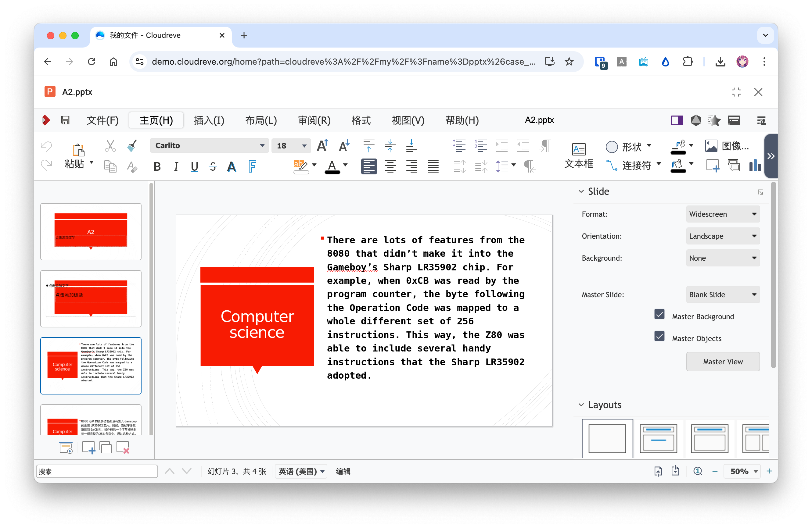
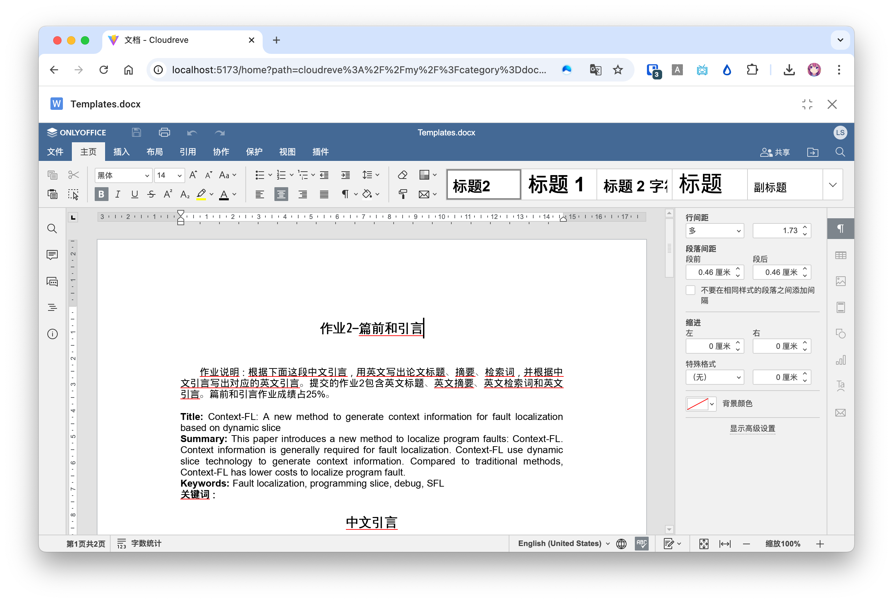

# Office 文档在线编辑 {#wopi}

Cloudreve 支持通过 WOPI 协议接入 Office 文档在线编辑和协作功能。本文将介绍三种支持 WOPI 协议的服务的部署及对接方式。你也可以通过实现自己的 WOPI 客户端，扩展 Cloudreve 的预览编辑能力（不仅限于 Office 文档）。

## WOPI 协议 {#wopi-protocol}

Web Application Open Platform Interface (WOPI) 协议是一种用于集成 Web 文档编辑器的协议，你可以在 [微软的文档](https://learn.microsoft.com/en-us/microsoft-365/cloud-storage-partner-program/online/) 中阅读详细的协议定义。Cloudreve 可以对接实现了 WOPI 协议的文档处理服务，用于扩展已有的文档预览和编辑能力。

### 兼容性 {#wopi-compatibility}

| Method          | 支持情况 |
| --------------- | -------- |
| CheckFileInfo   | ✅       |
| GetFile         | ✅       |
| Lock            | ✅       |
| RefreshLock     | ✅       |
| Unlock          | ✅       |
| PutFile         | ✅       |
| PutRelativeFile | ✅       |
| RenameFile      | ✅       |

## 搭建 WOPI 服务 {#wopi-service}

请选择任何一个 WOPI 服务进行部署。

### Collabora Online (LibreOffice Online)



使用 Docker 部署 Collabora Online（[官方文档](https://sdk.collaboraonline.com/docs/installation/CODE_Docker_image.html#code-docker-image)）：

```bash
docker run -t -d -p 127.0.0.1:9980:9980 \
           -e "aliasgroup1=<允许使用此服务的 Cloudreve 地址，包含明确端口>" \
           -e "username=<面板管理员用户名>" \
           -e "password=<面板管理员密码>" \
           --name code --restart always collabora/code
```

以官方演示站为例：

```bash
docker run -t -d -p 127.0.0.1:9980:9980 \
           -e "aliasgroup1=https://demo.cloudreve.org:443" \
           -e "username=<面板管理员用户名>" \
           -e "password=<面板管理员密码>" \
           --name code --restart always collabora/code
```

容器启动后，配置 Nginx 或其他 Web 服务器反向代理 https://127.0.0.1:9980, 可参考 [Proxy settings](https://sdk.collaboraonline.com/docs/installation/Proxy_settings.html)。

### OnlyOffice



OnlyOffice 在 6.4 版本后支持了 WOPI 协议，请参考 官方文档 部署你的 [OnlyOffice](https://helpcenter.onlyoffice.com/) 实例。推荐使用 [Docker-DocumentServer](https://github.com/ONLYOFFICE/Docker-DocumentServer) 来快速部署。

参考 [官方文档](https://helpcenter.onlyoffice.com/installation/docs-developer-configuring.aspx#WOPI) 配置 OnlyOffice 开启 WOPI 功能。如果使用 Docker，可在创建 Contianer 时指定 `WOPI_ENABLED` 为 `true` 来开启：

```sh
docker run -i -t -d -p 8080:80 -e WOPI_ENABLED=true onlyoffice/documentserver
```

::: warning

OnlyOffice 不支持过滤 WOPI 请求来源，如果你有对公使用需求，请通过外部应用防火墙检查预览页面请求中 `wopisrc` 参数是否为预期的 Cloudreve 站点。

:::

### Office Online Server (On-Prem)

[Office Online Server](https://learn.microsoft.com/en-us/officeonlineserver/office-online-server) 是微软推出的可私有部署的 Office 在线文档服务。请参考 [官方文档](https://learn.microsoft.com/en-us/officeonlineserver/deploy-office-online-server) 在你的 Windows Server 上部署。

你可以手动访问 `<你的 OnlyOffice 主机>/hosting/discovery` 来确认是否返回了预期的 XML 响应。

## 导入 WOPI 编辑器设置 {#import-wopi-editor-settings}

请先完成以下检查清单确保 WOPI 服务可用：

- 请求 `<你的 WOPI 服务端点>/hosting/discovery`，应返回 XML 格式的响应；
- 确认 WOPI 服务端点可以被最终用户访问；
- 确认你在 Cloudreve `参数设置` -> `站点信息` -> `站点 URL` 中设置的 `主要` 站点 URL 可以被容器中的 WOPI 服务访问。

确认以上检查项无误后，前往 Cloudreve 后台的 `参数设置` -> `文件系统` -> `文件浏览应用` -> `添加应用` -> `WOPI 协议应用`, 将 `<你的 WOPI 服务端点>/hosting/discovery` 填写到 `WOPI Discovery Endpoint` 中导入设置。提交后，“文件浏览应用”中会出现一个新的分组，你可以根据需要调整导入的应用名称和图标。
